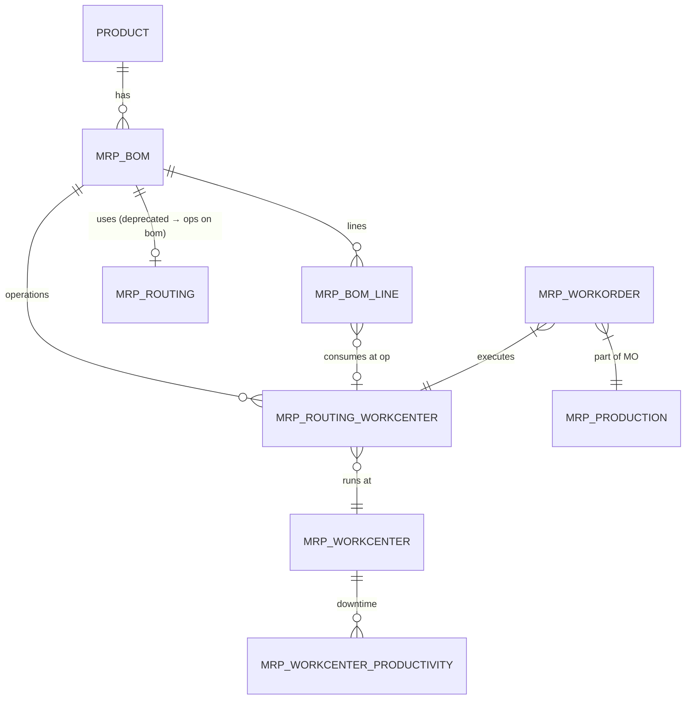
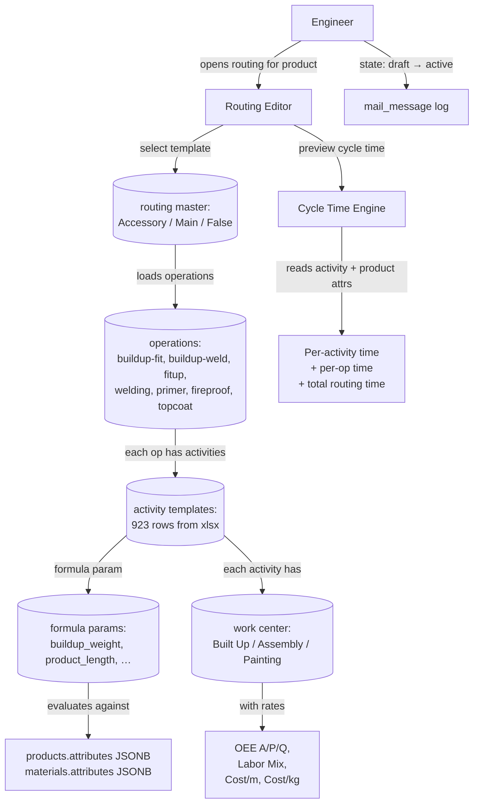

# Gap Analysis — Routing & Standard Time (BDT)

> **Author:** Cowork (architect / BA / SA pass)
> **Date:** 2026-04-29
> **Sprint target:** Sprint 4 — Routing + Work Center + Std Time
> **Companion docs:**
> - [`SPRINT_PLAN_ROUTING_STD_TIME.md`](./SPRINT_PLAN_ROUTING_STD_TIME.md) — implementation plan (UX/UI + Fullstack)
> - [`STANDARDIZE_VS_CUSTOM_ODOO.md`](./STANDARDIZE_VS_CUSTOM_ODOO.md) — Odoo ADR (existing)
> - [`SPRINT_PLAN_BOM_DRAWINGS.md`](./SPRINT_PLAN_BOM_DRAWINGS.md) — Sprint 3 contract
>
> **Inputs analysed:**
> - `bdt-app/document/Production-Std-Time-Cost-Machines.xlsx` (15 sheets — machine cost/capacity engine)
> - `bdt-app/document/process routing.xlsx` (16 sheets — routing/activity master + project samples)
>
> **Reference frameworks:**
> - **Odoo 17 MRP** (`mrp.routing.workcenter`, `mrp.workcenter`, `mrp.workcenter.productivity`, `mrp.workorder`, `mrp.eco`)
> - **Siemens Opcenter Execution / APS** (Resource Model, Process Segment, OEE A/P/Q split, Production Capability)
> - **ISA-95 / ANSI 95.00.03** (Equipment hierarchy, Production Capability, Operations Definition)
> - **Steel-shop fabrication practice** (AISC fabrication, CISC steel detailing — built-up beam SAW, fit-up, painting)

---

## 1. Executive summary

| # | Finding | Verdict |
|---|---|:-:|
| 1 | `Production-Std-Time-Cost-Machines.xlsx` is a **machine-level cost/capacity engine**, not a routing master. The 12 per-machine sheets contain inputs that should normalise into Odoo `mrp.workcenter` fields — but **3 BDT-specific extensions need to be kept** (OEE A/P/Q split, Labor Mix, Effective Factor). | 🟨 Hybrid |
| 2 | `process routing.xlsx → ro_op_act_me` is a **parametric routing definition**: `cycle_time = (measured / std_measure) × per_minute`. This pattern is **richer than Odoo** (which uses flat `time_cycle`) and matches Siemens Opcenter "Process Segment with Parameters". | 🟥 Custom (formula engine) |
| 3 | Existing `routing` sheet (Accessory/Main/False × Operation × Work Center) maps cleanly to Odoo `mrp.routing.workcenter`. **Use as-is.** | 🟦 Standard |
| 4 | `workcenter` sheet has correct ISA-95 fields (OEE Target, Performance, Productive Time, Time Efficiency, Time before/after prod) — but no Availability/Quality split. Siemens enrichment needed. | 🟨 Hybrid |
| 5 | `MO` and `SN` sheets show a **per-zone, per-mark cycle-time aggregate** that's already production-grade (matches Odoo `mrp.production` + serial-tracked workorder). Treat as preview/seed for Sprint 5 MO module. | 🟦 Standard |
| 6 | No **routing ↔ BOM linkage** in either xlsx. Odoo MRP requires `mrp.bom.line.operation_id` so that material consumption attaches to a routing step. Must add. | 🟦 Add |
| 7 | No **setup/teardown time, queue time, move time** anywhere — only run time. Siemens Opcenter / Odoo both expect setup. Must add. | 🟥 Gap |
| 8 | No **personnel qualification / skill matrix**. Headcount is captured (Manpower) but not skill grade. Defer to Sprint 6 HR. | 🟡 Defer |
| 9 | The "Rebalance Model" (`OEE × Utilization → Effective factor`) in xlsx duplicates `Capacity` calculation. Should consolidate to single source. | ⚠️ Cleanup |
| 10 | The cycle-time engine reads from product attributes (`buildup_weight = sumWeight × 0.8`, `product_length`, `product_perimeter`). These attributes already exist in Sprint 1 `materials.attributes` JSONB and Sprint 2 `products.attributes` JSONB — **infrastructure already in place**. | ✅ Reuse |

**Conclusion:** Build **3 layers** in Sprint 4:
1. **Master layer** (🟦 Odoo): `mrp_routing` + `mrp_workcenter` + `mrp_workcenter_productivity` (downtime tracking deferred).
2. **Standard-time layer** (🟨 Hybrid): work-center-level OEE A/P/Q + Labor Mix + cost rates (THB/m, THB/kg) — extends Odoo `costs_hour`.
3. **Activity formula layer** (🟥 Custom): `routing_activity_template` + `cycle_time_formula` evaluator that reads product attributes — Odoo doesn't have this.

---

## 2. As-is reading — what each xlsx really contains

### 2.1 `Production-Std-Time-Cost-Machines.xlsx`

A 3-tier cost/capacity model. Variables are **plant-level** and **machine-level**, not routing-level.

```
┌─────────────────────────────────────────────────────────┐
│  Tier 1: Main (plant constants)                          │
│  ─ 30 day/month, 14 hr/day, 396 hr/month                 │
│  ─ THB rates: electricity, oxygen, fuel, water, labor    │
│  ─ Maintenance % / Depreciation life (60 mo)             │
└─────────────────────────────────────────────────────────┘
                       ↓ feeds
┌─────────────────────────────────────────────────────────┐
│  Tier 2: Per-machine sheet (12 machines)                 │
│  ─ Lookup table → speed, kWh/m, gas/m, consumable/m     │
│  ─ Manpower × labor rate × efficiency                    │
│  ─ Working hrs × OEE × Utilization × Eff factor          │
│  ─ Output: Capacity (kg/m/pc per month) + Cost/unit     │
└─────────────────────────────────────────────────────────┘
                       ↓ aggregated
┌─────────────────────────────────────────────────────────┐
│  Tier 3: Summary                                         │
│  ─ 16 rows × { Cap kg/month, Cost THB/kg, Process }      │
└─────────────────────────────────────────────────────────┘
```

**Machines covered (12):** CNC Plate ×2 (Plasma+Gas), CNC Pipe Plasma ×3, SAW Machine, CNC Plate Drill, Press Brake, Hydraulic Press, Straightening Machine, Rod Threading Machine.

**Quality:** ⭐⭐⭐⭐ — formulas correct, units consistent, lookup tables granular. Issues: 
- `OEE = #VALUE!` in some sheets (Drill, Press Brake, Hydraulic, Straightening) due to empty Labor Mix → should default to 100% Operator if unset.
- Same constants (working_hrs, labor rates) repeated per sheet — should normalise to FK to `mrp_workcenter`.

### 2.2 `process routing.xlsx`

A **routing master** + **project sample data**. 16 sheets:

| Sheet | Purpose | Use in Sprint 4 |
|---|---|---|
| `phase` | Project phases (24 rows) | Reuse — already in Sprint 2 `project_zone` |
| `position-code` | BIM positions × zone × predecessor (1,732 rows) | Reuse — Sprint 5 erection planning |
| `assembly-list` | Per-assembly attributes (50,500 rows) — Mark, weight, area, parts, TYPEPAINT | Reuse — links to `products` (Sprint 2) |
| `Construction Payment` | Payment milestones (23 rows) | Out of scope |
| `MO` | Manufacturing Order template — per-zone, per-mark cycle-time aggregate (998 rows) | Sprint 5 MO seed |
| `SN` | Serial Number — per individual product cycle time (1,000 rows) | Sprint 5 SN seed |
| **`ro_op_act_me`** | **Routing × Op × Activity × Measure × Equipment (42 rows)** | ⭐ **Primary input for Sprint 4** |
| `workcenter` | Operation × Work Center master (991 rows) | ⭐ Seed `mrp_workcenter` |
| `machine_equipment` | Equipment register (220 rows) | Sprint 5 maintenance |
| `routing` | Routing template — Accessory/Main/False (28 rows) | ⭐ Seed `mrp_routing` |
| `parameter` | Formula definitions (19 rows) | ⭐ Seed `routing_formula_param` |
| `activites` | Activity templates with std_measure × ratio (923 rows) | ⭐ Seed `routing_activity_template` |
| `activities_parameter` | Formula glossary BEAM/PEB/PIPE (16 rows) | Documentation |
| `consumable` | Consumables list (200 rows) | Sprint 5 BOM-routing link |
| `standard code` | Naming standard (15 rows) | ✅ Already Sprint 2 |
| `Form_MO` | Empty placeholder | Skip |

**The cycle-time formula in `ro_op_act_me`:**

```
cycle_time_min = ceil(measured_value / std_measure) × per_minute

where:
  measured_value = evaluate( parameter, product_attributes )
  std_measure    = constant per activity row
  per_minute     = constant per activity row (rate factor, units = min)

Example — "buildup-fit / Lift workpiece onto Jig":
  parameter      = buildup_weight = sumWeight × 0.8
  std_measure    = 500 kg
  per_minute     = 10 min
  
  For sumWeight = 2500 kg:
  measured       = 2500 × 0.8 = 2000 kg
  cycle_time     = ceil(2000/500) × 10 = 4 × 10 = 40 min
```

Multi-parameter activities (welding) multiply two ratios:
```
cycle_time_min = (m1/std_m1) × (m2/std_m2) × per_minute

Example — "buildup-welding / Weld bead 1st side":
  m1 = buildup_weldingsize, std_m1 = 6 mm, ratio1
  m2 = product_length,      std_m2 = 1 m,   ratio2
  per_minute = 2.5 min
  
  For weldingsize = 6 mm, length = 12 m:
  cycle_time = (6/6) × (12/1) × 2.5 = 30 min
```

19 formula parameters defined (`buildup_weight`, `product_length`, `product_perimeter`, `assembly_point`, etc.).

---

## 3. Reference framework — Odoo + Siemens + ISA-95

### 3.1 Odoo 17 MRP — entity model



**Key fields:**

```python
mrp.workcenter
  ─ name, code, sequence
  ─ resource_id (m2o → resource.resource — calendar)
  ─ time_efficiency (Float, default 100)         # speed factor
  ─ oee_target (Float, default 90)
  ─ time_start (Float)                            # setup before
  ─ time_stop (Float)                             # cleanup after
  ─ capacity (Float)                              # parallel units
  ─ costs_hour (Float)                            # THB/hour
  ─ alternative_workcenter_ids
  ─ tag_ids (m2m → mrp.workcenter.tag)

mrp.routing.workcenter
  ─ name, sequence
  ─ workcenter_id (m2o)
  ─ time_cycle (Float)                            # min/unit
  ─ time_cycle_manual (Float)
  ─ time_mode (auto|manual)
  ─ time_mode_batch (Integer, default 10)
  ─ blocked_by_operation_ids                      # dependency graph
  ─ allow_operation_dependencies (bool)
  ─ bom_id (m2o → mrp.bom)
```

**Where Odoo falls short for steel:**
- `time_cycle` is flat (per-unit) — **doesn't support BDT formula model**
- No "activity inside operation" granularity (Odoo: 1 op = 1 row; BDT: 1 op = 6 activities)
- No OEE breakdown (just `oee_target`); ISA-95/Siemens require A × P × Q

### 3.2 Siemens Opcenter Execution — Resource & Process Segment

```
ISA-95 Resource Hierarchy
  Enterprise ► Site ► Area ► WorkCenter ► WorkUnit ► Equipment
  
  BDT mapping:
    Enterprise = SSI Group
    Site       = BDT (BPK / BKK)
    Area       = Shop floor zone
    WorkCenter = Built-Up | Assembly | Painting | Prepare Material
    WorkUnit   = SAW Gantry | Press Brake | CNC Plate 01 | …
    Equipment  = Hilti laser, Elcometer 456, hand tools (220 items)
```

**Process Segment** (Opcenter / ISA-95 Operations Definition):
```
ProcessSegment {
  id, name, description
  Duration { min, max, expected, formula }
  PersonnelSpec { qty, qualification }
  EquipmentSpec { qty, capability }
  MaterialSpec { qty, property }
  PhysicalAssetSpec { ... }
  ProcessSegmentDependency { sequence | parallel | …}
  ProcessSegmentParameter { name, value, dataType }
}
```

**This maps 1:1 to BDT `ro_op_act_me`:**
- ProcessSegment ≈ Operation (buildup-fit, welding, painting)
- Activity ≈ ProcessSegment with sub-segment relation
- ProcessSegmentParameter ≈ `parameter` sheet
- Duration.formula ≈ BDT cycle-time formula

**OEE in Opcenter:**
```
OEE = Availability × Performance × Quality
  Availability = (PlannedTime − Downtime) / PlannedTime
  Performance  = (IdealCycle × OutputQty) / RunTime
  Quality      = GoodQty / TotalQty
```

BDT xlsx has only single OEE % — **no A/P/Q split**. Need to extend `mrp_workcenter` with these three.

### 3.3 Steel fabrication shop practice (AISC / Thai PEB)

Standard built-up beam routing (matches `routing` sheet `Main` template):

```
1. PREPARE  ─ Material kitting from warehouse
2. CUT      ─ Plate plasma/gas → web/flange parts
              Pipe plasma → cap plates
              Drill → bolt holes
              Bend / Press / Threading (selective)
3. BUILD-UP ─ Buildup-Fit:    web + flange tack assembly on jig
              Buildup-Weld:   SAW 4-pass (4 corners) OR submerged arc
              Finishing:      grind, mark
4. ASSEMBLY ─ Fit-up:         attach gussets, ribs, stiffeners
              Welding:        MIG/MAG full weld
              Grinding:       cleanup
              Finishing:      tag, mark, record
5. PAINTING ─ Blast / clean
              Primer
              Fireproof (intumescent, optional)
              Topcoat
6. INSPECT  ─ Dim check, NDT, paint thickness (Elcometer)
```

BDT `routing` sheet shows: ✅ Built Up · ✅ Assembly · ✅ Painting · ✅ Prepare Material — coverage is correct.

**Differences from generic Odoo MRP:**
- 4-side welding sequence is **steel-domain specific** (most ERP MRP assumes 1 weld per op)
- Painting has **3 coats sequential** (primer → fireproof → topcoat) — needs queue/dry time
- Buildup-fit and Buildup-weld are **separate work orders** that require tooling/jig changeover

---

## 4. Detailed gap matrix

Legend: 🟦 Standard Odoo · 🟨 Hybrid (Odoo + extension) · 🟥 Custom BDT · 🟡 Defer · ✅ Already done

### 4.1 Master data

| Entity | Odoo equivalent | BDT current state | Decision | Notes |
|---|---|---|:-:|---|
| Routing template | `mrp.routing.workcenter` (group by `bom_id`) | `routing` sheet — 28 rows × 3 templates | 🟦 | direct seed |
| Work Center | `mrp.workcenter` | `workcenter` sheet — 4 work centers (Built Up, Assembly, Painting, Prepare Material) | 🟨 | + OEE A/P/Q + Labor Mix + cost/m,kg |
| Machine / Equipment | `maintenance.equipment` (Odoo Maintenance) | `machine_equipment` sheet — 220 rows | 🟡 | defer to Sprint 6 (Maintenance module). Sprint 4 stores equipment_ref string only |
| Activity Template | ❌ No Odoo equivalent | `activites` sheet — 923 rows | 🟥 | new BDT-only entity `routing_activity_template` |
| Cycle-Time Formula Parameter | ❌ No Odoo equivalent | `parameter` sheet — 19 formulas | 🟥 | new BDT-only entity `routing_formula_param` |
| Consumable per activity | `mrp.bom.line` (with `operation_id`) | `consumable` sheet (200 rows) + columns in `ro_op_act_me` | 🟦 | extend BOM line; defer wiring to Sprint 5 |
| Standard code (zone, mark) | ❌ Custom | `standard code` sheet | ✅ | already in Sprint 2 |

### 4.2 Cost / capacity engine

| Concept | Odoo | Siemens | BDT current | Decision |
|---|---|---|---|:-:|
| Labor cost | `mrp.workcenter.costs_hour` (single rate) | Personnel Class with rate per qualification | 3-tier (Operator/Skilled/Group Head) + Mix % per WC | 🟨 Hybrid — extend `costs_hour` with `labor_mix_json` |
| Energy/utility | not modelled (off-topic for MRP) | Energy Module | Per-machine: kWh/m × THB/kWh + Air, O2, Fuel | 🟥 Custom — `mrp_workcenter.utility_cost_per_unit_json` |
| Consumable | `mrp.bom.line` | Material Spec on Process Segment | THB/m on machine sheet | 🟦 Move to BOM line (Sprint 5) — Sprint 4 stores aggregate only |
| Maintenance | `maintenance.request` (separate) | Maintenance Module | % per month × purchase price | 🟡 Defer Sprint 6 |
| Depreciation | not in MRP — `account.asset` | Asset accounting | / 60 months on machine sheet | 🟡 Defer (accounting module) |
| OEE | `mrp.workcenter.oee_target` (single %) | A × P × Q breakdown | Single OEE + Utilization + Effective factor | 🟨 Extend with 3-component split |
| Capacity (kg/month) | `mrp.workcenter.capacity` (parallel only) | Production Capability | Computed from working_hrs × OEE × kg/m | 🟦 Same — use `capacity_per_period_json` |

### 4.3 Cycle-time formula model (the 🟥 core)

| Aspect | Odoo | Siemens | BDT need | Decision |
|---|---|---|---|:-:|
| Per-unit time | ✅ `time_cycle` Float | ✅ Duration.expected | ✅ for simple ops | 🟦 |
| Formula-driven time | ❌ | ✅ Duration.formula | ✅ for steel buildup/weld | 🟥 |
| Multi-parameter | ❌ | ✅ ProcessSegmentParameter | ✅ welding 2-ratio | 🟥 |
| Activity grain (sub-op) | ❌ 1 op = 1 row | ✅ Sub-ProcessSegment | ✅ 6 activities/op | 🟥 |
| Idle time flag | ❌ | ❌ | ✅ `include_idle` Y/N column | 🟥 |
| Manual override | ✅ `time_cycle_manual` | ✅ | ✅ keep both | 🟦 |
| Setup/teardown | ✅ `time_start`/`time_stop` on WC | ✅ | ❌ missing in xlsx | 🟦 add |

### 4.4 Routing ↔ BOM linkage

| Direction | Odoo | BDT current | Decision |
|---|---|---|:-:|
| BOM line → consumed at which op | `mrp.bom.line.operation_id` (m2o → routing_workcenter) | ❌ Not linked | 🟦 Sprint 5 (after Sprint 4 routing exists) |
| Routing op → produces which sub-product | `mrp.production.move_finished_ids` (per WO) | ❌ | 🟡 Sprint 5 |
| BOM view ↔ Routing view | eBOM uses eRoute, mBOM uses mRoute | ❌ Single routing | 🟨 Sprint 4 add `routing_view` enum (default eRoute) |

### 4.5 MES execution (out of scope Sprint 4)

| Concept | Odoo | BDT current | Decision |
|---|---|---|:-:|
| Manufacturing Order | `mrp.production` | `MO` sheet (sample) | 🟡 Sprint 5 |
| Work Order | `mrp.workorder` | implied from `SN.Total_cycletime` | 🟡 Sprint 5 |
| Serial Number | `stock.production.lot` | `SN` sheet (sample) | 🟡 Sprint 5 |
| Shop floor productivity | `mrp.workcenter.productivity` | ❌ | 🟡 Sprint 5 (downtime tracking) |
| Quality check | `quality.check` (Quality module) | hand tools (Elcometer 456) | 🟡 Sprint 6 |
| ECO impact on routing | `mrp.eco` covers routing too | ❌ | 🟦 Sprint 5 (after ECO module) |

---

## 5. Process flow — to-be (target design)

### 5.1 Engineering routing authoring (Sprint 4)



### 5.2 Cycle-time computation pipeline

```
Input:  product_id (Sprint 2)
        routing_template_id

For each operation in routing_template:
  For each activity in operation:
    1. Read activity.formula_param_id → param.formula_expression
    2. Evaluate expression against product.attributes
       e.g., "sumWeight * 0.8" → 2000 kg
    3. measured_value = result
    4. ratio_count = ceil(measured_value / activity.std_measure)
    5. base_time = ratio_count × activity.per_minute
    6. If activity has secondary param:
         base_time *= ratio2_count
    7. If activity.include_idle: base_time *= idle_factor
    8. cycle_time_min = base_time
    9. Apply work_center.time_efficiency: cycle_time /= time_efficiency
   10. Add to operation_total
  
  operation.std_time_min = sum(activity.cycle_time_min for activity in operation)
  operation.std_cost     = operation.std_time_min × work_center.cost_per_min
                           + sum(consumable.qty × consumable.rate)
  operation.std_cost_per_kg = operation.std_cost / product.weight_kg

routing.total_std_time_min = sum(operation.std_time_min)
routing.total_std_cost     = sum(operation.std_cost)
```

Outputs are **denormalised** onto `product_routing_step.std_time_min` after first compute, and **invalidated** when product attrs OR activity templates OR WC rates change (cache key = hash of inputs).

### 5.3 Std cost rollup (consume Sprint 3 BOM)

```
total_std_cost(product) =
    cost_raw_material   ← BOM line × material price       (Sprint 3 — pending)
  + cost_routing        ← routing total computed above    (Sprint 4 — this sprint)
  + cost_transport      ← Sprint 6
  + cost_warehouse      ← Sprint 6
```

`products.cost_production` from Sprint 2 is the field this sprint populates.

---

## 6. Decisions & ADR pointers

| ADR | Decision | Rationale |
|---|---|---|
| **ADR-RT-1** | Use Odoo `mrp.routing.workcenter` schema convention but rename PK to keep consistency with Sprint 1-3 | snake_case `mrp_routing_workcenter` table; field names match Odoo (`time_cycle`, `time_mode`, `sequence`) |
| **ADR-RT-2** | Add 2 BDT-custom tables: `routing_activity_template` and `routing_formula_param` | Odoo doesn't model activity granularity or formula time. Without these, must hard-code 923 activities into 28 routing ops — losing reusability. |
| **ADR-RT-3** | Cycle-time formula evaluator uses **safe expression engine** (whitelist arithmetic + named attributes), NOT `eval()` | Security; product attrs can come from BIM imports. Recommend `expr-eval` or `mathjs` (already in dependencies). |
| **ADR-RT-4** | OEE stored as 3 columns (`availability`, `performance`, `quality`) with computed column `oee = a × p × q`. Keep `oee_target` (Odoo-standard) as separate field for forecast vs actual. | ISA-95 + Siemens compliance + Odoo compat |
| **ADR-RT-5** | Labor Mix stored as JSONB `labor_mix = {operator: pct, skilled: pct, group_head: pct}` with sum=100 CHECK | Avoids wide schema; matches xlsx structure |
| **ADR-RT-6** | Work-center cost has 4 components stored separately: `labor_cost_per_min`, `electricity_cost_per_min`, `consumable_cost_per_min`, `overhead_cost_per_min`. Computed `cost_per_min` aggregates. | Allows variance analysis and Sprint 6 cost variance reports |
| **ADR-RT-7** | Routing operations created in Sprint 4 use **read-only seed from xlsx** (28 ops). Custom routing creation deferred to Sprint 5. | De-scope; engineers can clone seed routings into new ones |
| **ADR-RT-8** | Activity template's `equipment_ref` is a free-text string in Sprint 4; FK to `maintenance_equipment` in Sprint 6 | Avoid Sprint 6 dependency |
| **ADR-RT-9** | Cycle time recompute is **on-demand** (not auto on attr change), surfaced via "Recompute" button + a SHA-256 cache key | Avoid runaway recomputes when bulk importing BIM products |
| **ADR-RT-10** | `mrp_workcenter.capacity_per_period_json` mirrors xlsx `Summary` shape: `{kg_per_month, m_per_month, pc_per_month}` | Allows queries like "kg/month for SAW" without recompute |

---

## 7. Risks & mitigations

| # | Risk | Severity | Mitigation |
|---|---|:-:|---|
| R1 | Formula expressions in 923 activity rows may have typos / undefined params | 🟠 Med | Validation seed step: every `parameter` referenced must exist; CI test that all 923 rows compute against a sample product |
| R2 | Cycle-time recompute on 50,500 BIM assemblies × 6 ops × 6 activities = 1.8M evaluations — slow | 🟠 Med | (a) on-demand only, (b) cache by attribute hash, (c) async batch job for full project recompute |
| R3 | Engineers may want to edit activity templates per-product (overrides) | 🟡 Low | Add `routing_step_override` table — Sprint 5 if requested |
| R4 | OEE A/P/Q split values may not be measurable yet — falls back to 1.0 | 🟡 Low | Default A=1, P=time_efficiency, Q=1; warn UI |
| R5 | xlsx data has `#VALUE!` errors in 4 sheets (Drill, Press Brake, Hydraulic Press, Straightening) | 🟢 Trivial | Default Labor Mix = {operator:100, skilled:0, gh:0} when empty |
| R6 | "Buildup-fit" + "Buildup-weld" are 2 separate ops with **shared jig** — capacity must consider jig contention | 🟠 Med | Add `mrp_workcenter.shared_resource_tag` field — Sprint 4 schema only; queueing logic Sprint 5 |
| R7 | Multi-zone projects (zone1/zone3/zone4 from `phase`) need parallel routing instances | 🟡 Low | Inherits from products.project_id + erection_zone_id (Sprint 2 — already done) |

---

## 8. What this sprint does NOT solve (explicit)

- Manufacturing Order / Work Order execution (MES) — Sprint 5
- Real-time downtime / OEE measurement — Sprint 5
- Tekla import that auto-creates routings — Sprint 5
- ECO governance over routing changes — Sprint 5
- Maintenance / equipment reliability — Sprint 6
- Quality check plans — Sprint 6
- Capacity planning / finite scheduling — Sprint 7+
- Tool/jig changeover scheduling — Sprint 7+

---

## 9. Validation plan

Before Sprint 4 closes, the following must pass:

1. **Seed validation:** all 28 routing rows + 923 activity rows + 19 parameters + 4 work centers loaded without errors.
2. **Formula coverage:** every `parameter` mentioned in `activites` is defined in `parameter` master.
3. **Sample compute:** 1 sample built-up beam (WH-CO-1 from 0X202 project, 1236.6 kg, length 12 m, perimeter 4.8 m) computes a total cycle time within ±15% of the `MO` sheet aggregate (`-1.0 + -1.0 + -1.0 + -1.0 + -3.0 + -7.0 + -2.0 = -15.0` days = 8 hr × 60 min × 15 = 7200 min for the column).
4. **Round-trip:** modify product `sumWeight` from 1236 → 2000 kg, recompute, verify cycle time scales correctly.
5. **Cost rollup:** `cost_production = routing.total_std_cost` populates `products.cost_production` (Sprint 2 column).
6. **API smoke:** `GET /products/:code/routing` returns full tree (op → activities → cycle_time + cost) in <500 ms for a typical column.

---

*— end of gap analysis. Continue to [`SPRINT_PLAN_ROUTING_STD_TIME.md`](./SPRINT_PLAN_ROUTING_STD_TIME.md) for the implementation plan.*
