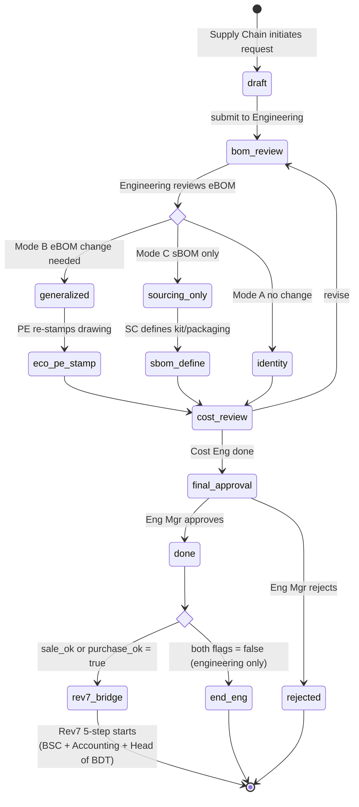

# Custom → Standard Promotion Lifecycle — Critical Analysis & Design

> **Project:** BDT Engineer Management System
> **Date:** 2026-04-27
> **Companion to:** [`STANDARD_VS_CUSTOM_PRODUCT.md`](./STANDARD_VS_CUSTOM_PRODUCT.md) (rev 2)
>
> **Trigger condition (จาก stakeholder):**
> 1. Master มี 2 type — custom + standard
> 2. Product สามารถถูก promote ให้เป็น item ซื้อ/ขาย (อิง Odoo config)
> 3. Product ที่ถูก promote = ปรับเป็น standard product ในตัว
>
> **Why this doc exists:** เงื่อนไข 3 ข้อข้างต้นดูง่าย — แต่มี implicit design questions ≥10 ข้อที่ design ผิดทีเดียวคือทั้งระบบ broken. เอกสารนี้ surface ทุก trade-off ก่อนเขียน code

---

## 1. Critical Findings (ก่อน design)

### 🔴 F1 — Identity Preservation: Clone vs Mutate

**คำถาม:** เมื่อ Custom A ถูก promote, A กลายเป็น Standard เลย หรือสร้าง Standard B ใหม่ที่ link ถึง A?

| Option | กลไก | Risk |
|---|---|---|
| **A. Mutate** | UPDATE products SET product_type='standard', product_code='STD-...' | 💥 BOM ของ project เก่าหา CUS-xxxxx เดิมไม่เจอ; CHECK constraints ขัด (ต้อง null project_id, mark_number); audit `mail_message` แสดง "type changed" สับสน |
| **B. Clone (เลือก)** | INSERT new STD row + `promoted_from_id` = A.id; original A คงอยู่ | ✅ ทุก project history clean; STD ตัวใหม่เริ่ม fresh ECO + variants; relation 1:1 ผ่าน `promoted_from_id` |
| C. Bridge | สร้าง bridge table `promotion_link` | Over-engineering (1:1 ไม่ต้อง bridge) |

**ตัดสินใจ: Clone (Option B)**

```sql
-- Custom (project-specific, สร้างใน project 7)
products(id=873, product_code='CUS-00873', product_type='custom',
         project_id=7, mark_prefix='B', mark_number='1',
         promoted_from_id=NULL)

-- Promotion creates NEW row
products(id=1542, product_code='STD-00253', product_type='standard',
         project_id=NULL, mark_number=NULL,
         promoted_from_id=873,
         legacy_codes=ARRAY['CUS-00873'])

-- Both rows coexist forever
```

### 🔴 F2 — Drawing Promotion ≠ UPDATE drawing_type

**ปัญหา:** Custom shop drawing ออกแบบเฉพาะ project (load, span, connection) — มาเป็น master drawing ตรง ๆ ไม่ได้

**Workflow correct:**
```
1. project_drawing_id=4421 (drawing_type='project', revision='IFC', stamped for Project 7)
2. Promotion request triggers Engineering review
3. Engineer "generalizes" the drawing — strip project-specific notes, parameterize dimensions
4. PE re-stamps as master drawing
5. INSERT new shop_drawing(drawing_type='master', generalized_from_id=4421, ...)
6. Original 4421 unchanged
```

**Schema add:**
```sql
ALTER TABLE shop_drawing ADD COLUMN generalized_from_id INT REFERENCES shop_drawing(id);
-- non-null only when drawing_type='master' AND generalized via promotion
```

### 🔴 F3 — Cost Engineering Pass

**ปัญหา:** Custom มี actual cost จาก project. Standard ต้องการ standard_cost ที่เหมาะกับการใช้ทั่วไป

**Algorithm:**
```python
def propose_standard_cost(custom_product_id):
    historical = query("""
        SELECT cost_raw_material, cost_transport, cost_production, cost_warehouse
        FROM project_product_cost
        WHERE product_id IN (
          SELECT id FROM products
          WHERE promoted_from_id = :pid OR id = :pid
          UNION
          SELECT id FROM products
          WHERE attributes_similar_to(:pid, tolerance=0.05)
        )
    """, pid=custom_product_id)

    if len(historical) >= 3:
        return {comp: median([r[comp] for r in historical])
                for comp in ['raw_material','transport','production','warehouse']}
    elif len(historical) >= 1:
        return {comp: historical[-1][comp] * 1.05  # latest + 5% safety
                for comp in COMPONENTS}
    else:
        return None  # require manual entry
```

**State:** ต้องมี `cost_review` state ใน promotion workflow เพื่อให้ Cost Engineer review ก่อน

### 🔴 F4 — Variant Inference (rev 3 — tolerance < 0.5mm)

**ปัญหา:** Standard product ต้องการ `variant_attributes` matrix. Custom ไม่มี matrix (เป็น 1 design 1 mark)

**Solution:** Auto-suggest จาก historical custom ที่ "คล้าย" — **tolerance < 0.5 mm** (per stakeholder Q3 rev-3)

**ทำไม < 0.5 mm:**
- Steel mill standard rolls dimensions ใน 5mm หรือ 10mm increments
- Manufacturing tolerance ปกติ ±1mm (per AISC 303)
- < 0.5mm = practically same dimension within rounding error
- ใหญ่กว่านี้จะ false-match (เช่น H=300 vs H=305 = ของคนละแบบ)

```python
def suggest_variants(custom_product_id, dim_tolerance=0.5):
    p = get_product(custom_product_id)

    # Fetch historical with tight similarity
    similar = query("""
        SELECT attributes
        FROM products
        WHERE product_type = 'custom'
          AND categ_id = :categ
          AND mark_prefix = :prefix
          AND name ILIKE :name_pattern
    """, categ=p.categ_id, prefix=p.mark_prefix, name_pattern=f'%{p.name_main_term}%')

    # Group by variation parameter — collapse near-duplicates within tolerance
    def cluster(values, tol):
        if not values: return []
        sorted_vals = sorted(set(values))
        clusters = [[sorted_vals[0]]]
        for v in sorted_vals[1:]:
            if abs(v - clusters[-1][-1]) < tol:
                clusters[-1].append(v)
            else:
                clusters.append([v])
        return [round(sum(c)/len(c), 1) for c in clusters]

    return {
        'height_h': cluster([s['height_h'] for s in similar if s.get('height_h')], dim_tolerance),
        'width_b':  cluster([s['width_b']  for s in similar if s.get('width_b')],  dim_tolerance),
        'thickness_t': cluster([s['thickness_t'] for s in similar if s.get('thickness_t')], dim_tolerance),
        'grade':    sorted({s.get('grade') for s in similar if s.get('grade')}),
    }
```

UI แสดงเป็น checkbox — engineer เลือก include/exclude

**Notification scope (per stakeholder Q4):**
- ✅ stakeholders ใน promotion request (initiator, Eng Manager, Cost Engineer, PE)
- ✅ ongoing projects ที่ active BOM อ้างอิง source custom
- ❌ closed/handover projects — ไม่ notify (no actionable change)

### 🔴 F5 — Reusability Threshold

**ปัญหา:** เมื่อไหร่ "ควร" promote? ถ้า promote ทุกอันก็ standard มากเกิน, ถ้าน้อยไปก็เสีย reuse opportunity

**Eligibility checklist (objective):**

| เกณฑ์ | ค่า | บังคับ |
|---|---|:-:|
| ใช้ใน ≥ N projects | N=3 (configurable) | ✅ |
| Last design change > 6 months | ECO ไม่มีในช่วง 6 เดือน | ✅ |
| Has cost data ≥ 1 completed project | actual cost recorded | ✅ |
| Engineering Manager sponsorship | named approver | ✅ |
| Estimated reuse demand ≥ N more projects | forecast | ❌ (soft) |

ถ้าผ่าน ✅ ทั้ง 4 ข้อแรก → promotion request ถูก auto-suggest โดย system (notification to Engineering Manager)

### 🔴 F6 — Reversibility (Demote)

**คำถาม:** ถ้า promote แล้วใช้ไม่คุ้ม / มีปัญหา design — demote ได้ไหม?

**คำตอบ: NO demote**
- Custom = project-specific by definition; Standard ที่เคยถูก promote ไม่มี project_id ที่จะกลับไป
- ใช้ state `obsolete` แทน → ห้าม sale/purchase ใหม่ + projects เก่ายังเห็น
- ถ้าต้อง replace → ECO เปิด successor ใหม่ (Odoo standard pattern)

### 🔴 F7 — `sale_ok` / `purchase_ok` ไม่ Auto

**ปัญหา:** เงื่อนไข #2/#3 บอก "promote = ขาย/ซื้อได้" — แต่ไม่ใช่ทุก promoted standard ต้อง sale_ok

**ตัวอย่าง:**
- Promoted Main Beam (สำหรับ reuse cross-project) — ทั่วไป **ไม่ขาย** ลูกค้าโดยตรง (เป็นส่วนของ project deliverable) → `sale_ok=false`, `purchase_ok=false` (ผลิตเอง)
- Promoted Standard Purlin (commodity) — สามารถขายปลีกให้ contractor อื่น → `sale_ok=true`
- Promoted Custom Bolt design — อาจจะ outsource → `purchase_ok=true`

**Decision:** flag เป็นส่วนหนึ่งของ promotion form, **explicit choice**, ไม่ auto

### 🔴 F8 — Notification Cascade

ถ้า promote สำเร็จ — projects ที่ใช้ original custom ต้องรับรู้?

**Decision (per stakeholder Q4 rev-3):**
- Project 7 (origin of CUS-00873): ✅ notify PM
- Other ongoing projects ที่ active BOM อ้างอิง source custom: ✅ notify
- Other ongoing projects ที่มี similar attribute (no direct ref): ❌ skip — too noisy
- Closed/handover projects: ❌ no notification — no actionable change

### 🔴 F9 — Mark Prefix in Master Table

จาก Sheet "Engineer" ของ Product Engineer.xlsx — BDT มี dictionary 26+ entries:

```
Assemblies (p):  C, SC, P, RF, B, SB, CA, FR, LP, END, GUSSET, RIB, STIFF
Members (m):     PS, VB, HB, ST, R, PU, GR, SG, GU
Other (o):       FB, ANGLE
Sub-comp (w/f):  WEB, FLG
Truss (-):       TR
```

ห้าม hard-code เป็น enum — **ใช้ master table** เพราะ:
1. เพิ่ม prefix ใหม่ต้อง deploy → ใช้ table = admin add
2. Tekla import adapter ต้อง map "Tekla auto-prefix" (P1, P2) → BDT prefix (C1, B1) — table-driven
3. Reporting ต้อง JOIN เพื่อแสดง label/category

### 🔴 F10b — BOM Mutability During Promotion (3-Mode Model) ⭐ Critical

**คำถามจาก stakeholder:** "เมื่อ Supply Chain ขอ promote — BOM ของชิ้นงานเดิมจะเปลี่ยนไหม? ใครมี authority?"

**Standards reference:**
- ISO 10007:2017 (Configuration Management) — configuration item ต้องมี baseline + change control
- ISO 9001:2015 §8.3.6 (Design Changes) — บังคับ identify + review + control + authorize + retain
- AS9100D §8.3.6 — change ต้อง approval ก่อน implement
- Siemens Opcenter PLM — 3-BOM model (eBOM / mBOM / sBOM)

**Three BOMs (must not be confused):**

| BOM | Owner | Content |
|---|---|---|
| eBOM (As-Designed) | Engineering | Design intent — material, geometry, tolerance, scrap allowance |
| mBOM (As-Built) | Production | Actual build — substitutions, actual scrap %, process route |
| sBOM (As-Sold) | Supply Chain | Catalog view — kit grouping, packaging UoM, supplier preference |

**3 Promotion Modes:**

| Mode | BOM change? | Trigger | ECO required? |
|---|:-:|---|:-:|
| **A. Identity** | ❌ eBOM clone byte-for-byte | Engineering review: no design change | ❌ |
| **B. Generalized** | ✅ eBOM modified | Engineering finds need to generalize (e.g., remove project-specific supplier from anchor bolt spec) | ✅ mini-ECO |
| **C. Sourcing-only** | ❌ eBOM unchanged; new sBOM added | Supply Chain adds catalog/packaging view only | ❌ |

**Default = Mode A.** Mode B used only when Engineering review finds generalization opportunity.

**Authority (RACI) — simplified per stakeholder Q2 rev-3:**

| Activity | Engineering | Supply Chain | Cost Eng | Eng Mgr | PE |
|---|:-:|:-:|:-:|:-:|:-:|
| Initiate request | I | R | I | I | I |
| Decide mode A/B/C | R | C | I | **A** | I |
| Modify eBOM content | R | I | I | **A** | C |
| Define sBOM (kit/pkg) | I | R | C | **A** | – |
| Cost component review | I | I | R | **A** | – |
| Set sale_ok/purchase_ok | I | C | I | **R/A** | – |
| Final approval of promotion | I | I | I | **R/A** | I |
| Re-stamp master drawing (Mode B) | C | I | I | C | **R/A** |

**Stakeholder simplification:** Engineering Manager เพียงคนเดียวเป็น **Accountable** สำหรับการอนุมัติ promotion. Cost Engineer เป็น Responsible สำหรับ cost review (ไม่ใช่ approver). PE เกี่ยวข้องเฉพาะ Mode B (drawing re-stamp) — ไม่ใช่ approver ของ promotion เอง

**Separation of Duties:**
- Supply Chain = Initiator + sBOM owner (cannot modify eBOM)
- Engineering = eBOM authority (cannot unilaterally promote — needs SC trigger)
- No single role can both propose + approve + execute

**Schema impact:**

```sql
ALTER TABLE product_bom
  ADD COLUMN bom_view VARCHAR(10) NOT NULL DEFAULT 'eBOM',     -- 'eBOM'|'mBOM'|'sBOM'
  ADD COLUMN owner_role VARCHAR(20) NOT NULL,                   -- 'engineering'|'production'|'supply_chain'
  ADD COLUMN cloned_from_bom_id INT REFERENCES product_bom(id); -- promotion lineage

ALTER TABLE promotion_request
  ADD COLUMN promotion_mode VARCHAR(20) NOT NULL,               -- 'identity'|'generalized'|'sourcing_only'
  ADD COLUMN bom_change_eco_id INT REFERENCES mrp_eco(id),
  ADD COLUMN bom_diff_summary TEXT;

ALTER TABLE promotion_request ADD CONSTRAINT chk_generalized_requires_eco CHECK (
  promotion_mode != 'generalized' OR bom_change_eco_id IS NOT NULL
);
```

**Failure modes if not designed properly:**

| Anti-pattern | ผลกระทบ | Standard violated |
|---|---|---|
| Supply Chain silently swaps anchor bolt spec on promotion | Product fails in field; warranty claim | ISO 9001 §8.3.6 (uncontrolled design change) |
| Skip ECO on Mode B promotion | No traceable rationale; future ECO can't reference baseline | ISO 10007 (no change record) |
| Mode A done but actually changed scrap % | Cost forecast wrong; inventory shortage | IATF 16949 (process change uncontrolled) |
| Single person approves entire promotion | Fraud risk; design escape | SOX, ISO 27001 (no separation of duties) |

### 🔴 F10 — `legacy_codes` Array สำคัญ

**Use case:** project เก่ามี BOM ที่ reference `CUS-00873`. ถ้าทีมต้องการ trace ว่าตอนนี้กลายเป็น `STD-00253` แล้ว

**Solution:**
```sql
products.legacy_codes TEXT[]  -- contains ['CUS-00873'] for the new STD row
-- partial index for fast lookup
CREATE INDEX idx_products_legacy ON products USING GIN (legacy_codes);

-- query
SELECT * FROM products WHERE 'CUS-00873' = ANY(legacy_codes);
```

นอกจากนี้ยังเก็บ `promoted_from_id` (FK) สำหรับ direct link

### 🔴 F15 — Mark Prefix UX: 4-Layer Defense (per stakeholder Q1 rev-3)

**ปัญหา:** ภายใน 1 project, prefix B (Beam) และ HB (Horizontal Brace) ใกล้กัน — typo "B1" แทน "HB1" ทำลาย data integrity

**Stakeholder decision:** "Block at form, no admin override"

**Recommended UX (4-layer defense):**

| Layer | กลไก | Effect |
|---|---|---|
| **L1 — Form** | Dropdown autocomplete จาก `mark_prefix_master` table; **no free-text input** | typo ที่ source ป้องกัน 99% |
| **L2 — Live Preview** | Card แสดง: icon + label + category ของ prefix ที่เลือก ก่อน save<br>"**Beam** B1 (Project 7) — Assembly type" | user double-check ก่อน commit |
| **L3 — DB** | FK constraint: `products.mark_prefix → mark_prefix_master.code`<br>UNIQUE: `(project_id, mark_prefix, mark_number)` | impossible ที่ DB level จะมี invalid prefix หรือ duplicate |
| **L4 — No Override** | Admin **ไม่มี** "force update prefix" function หลัง state >= released; ถ้า typo = ลบ row + create ใหม่ (logged) | ป้องกัน backdoor + รักษา separation of duties |

**ทำไมห้าม admin override:**
- ISO 10007 Configuration Management — "Configuration item once baselined cannot be silently re-identified"
- ISO 9001 §7.5.3.2 — Documented information must be controlled (รวม identification)
- SOX / separation of duties — ผู้สร้างไม่ควรมีอำนาจ "fix" ตัวเอง
- Audit trail clarity — ลบ + สร้างใหม่ = 2 mail_message rows ชัดเจน; UPDATE prefix = ambiguous

**ข้อยกเว้น:** ใน state `draft` (ก่อน release) — engineer แก้ prefix ของตัวเองได้ (ยังไม่ baseline)

```sql
-- L3 implementation
ALTER TABLE products
  ADD CONSTRAINT fk_mark_prefix FOREIGN KEY (mark_prefix) REFERENCES mark_prefix_master(code);

CREATE UNIQUE INDEX idx_custom_mark_per_project
  ON products(project_id, mark_prefix, mark_number)
  WHERE product_type = 'custom';

-- L4 enforcement: prefix immutable after baseline
CREATE OR REPLACE FUNCTION prevent_mark_change_after_release()
RETURNS TRIGGER AS $$
BEGIN
  IF OLD.state IN ('released','obsolete')
     AND (OLD.mark_prefix IS DISTINCT FROM NEW.mark_prefix
          OR OLD.mark_number IS DISTINCT FROM NEW.mark_number) THEN
    RAISE EXCEPTION 'mark_prefix/number cannot change after release (state=%)', OLD.state;
  END IF;
  RETURN NEW;
END;
$$ LANGUAGE plpgsql;

CREATE TRIGGER trg_mark_immutable
  BEFORE UPDATE ON products
  FOR EACH ROW EXECUTE FUNCTION prevent_mark_change_after_release();
```

---

## 2. Promotion Workflow (State Machine)



**Rev 7 Bridge (PD-32):**
- เมื่อ promotion approved + `proposed_sale_ok` หรือ `proposed_purchase_ok` = true
- System auto-creates a **Material Register Form request** linked back to STD product (`linked_promotion_id`)
- Workflow ส่งเข้า 5-step Rev 7 process (ดู `STANDARD_VS_CUSTOM_PRODUCT.md` §3.5.3) สำหรับ assign Run Number 5 หลัก
- Engineering Manager approval ของ promotion **ไม่** ทดแทน Head of BDT approval — ต้องผ่านทั้งคู่
- Until Rev 7 process completes → STD product `item_code = NULL`, `odoo_compliance_status = 'NEW'`
- เมื่อ BSC assigns Run Number → `item_code` populated, status → 'MATCH'

**State responsibilities (rev-3 simplified — Eng Mgr single approver):**

| State | Owner | Output |
|---|---|---|
| draft | Supply Chain (Requestor) | reason, evidence (project list), proposed sale_ok/purchase_ok |
| bom_review | Engineering | decide promotion_mode (identity / generalized / sourcing_only) |
| eco_pe_stamp | PE | re-stamp updated master drawing (Mode B only) |
| sbom_define | Supply Chain | kit grouping, packaging UoM, supplier preference (Mode C only) |
| cost_review | Cost Engineer | 4 cost components + variance analysis (Responsible — not approver) |
| final_approval | **Engineering Manager (single approver)** | approve/reject + final sale_ok/purchase_ok |
| done | (auto) | new STD product row created + master drawing linked + sBOM/eBOM finalized + notifications |

---

## 3. Step-by-Step Use Case

**Scenario:** "Main Beam B1" ออกแบบใน Project 7 (Factory X), ใช้คล้ายกันใน Project 5, 9, 11. Engineering Manager เห็นว่า reuse worth promoting

| # | Actor | Action | System Effect |
|---|---|---|---|
| 1 | Supply Chain | Open `CUS-00873` (B1, Project 7) → "Request Promotion" | promotion_request row created (state=draft) |
| 2 | System | Fetch similar customs (mark_prefix='B', name~='Main Beam') | Returns 4 historical (P5, P7, P9, P11) |
| 3 | System | Auto-fill: reuse_evidence_count=4, proposed_variant_matrix={H:[300,350,400], grade:['SS400']} (clustered with <0.5mm tolerance) | shown in form |
| 4 | Supply Chain | Set proposed_sale_ok=false, proposed_purchase_ok=true; submit | state → bom_review |
| 5 | Engineering | Review eBOM; decide Mode A (Identity — no design change) | promotion_mode=identity; eBOM cloned as-is |
| 6 | System | Auto-skip eco_pe_stamp + sbom_define (Mode A) | state → cost_review |
| 7 | Cost Engineer | Pre-fill median from project_product_cost; adjust transport (-5%); confirm 4 components | proposed_standard_cost set; state → final_approval |
| 8 | **Eng Manager** | Review all (BOM + cost + flags); approve | state → done |
| 9 | System | Auto-create products(id=1542, product_code='STD-00253', promoted_from_id=873, legacy_codes=['CUS-00873']); link cloned eBOM; clone master drawing 4421 (no PE re-stamp needed for Mode A) | mail_message ใน CUS-00873 + STD-00253 |
| 10 | System | Notify stakeholders + PMs ของ ongoing projects ที่ใช้ CUS-00873 | mail_message + email (no notify to closed projects per Q4) |
| 11 | System | STD-00253 visible in Standard product catalog | sale_ok=false → not in sales catalog; purchase_ok=true → visible in PR/PO list |

**Note:** ตัวอย่างนี้คือ Mode A. Mode B จะแทรก step 6a "PE re-stamps generalized drawing" ก่อน cost_review. Mode C จะแทรก step 6b "Supply Chain defines sBOM (kit/packaging)"

---

## 4. Schema Migration

```sql
-- Mark prefix master (seed from Sheet "Engineer" ของ Product Engineer.xlsx)
CREATE TABLE mark_prefix_master (
  code            VARCHAR(10) PRIMARY KEY,
  label           VARCHAR(40) NOT NULL,
  category        VARCHAR(20) NOT NULL,        -- 'assembly'|'member'|'other'|'sub_component'|'plate_part'
  part_type_code  CHAR(1) NOT NULL,            -- 'p'|'m'|'o'|'w'|'f'
  active          BOOLEAN NOT NULL DEFAULT true
);

-- Seed
INSERT INTO mark_prefix_master(code, label, category, part_type_code) VALUES
  ('C',  'Column',           'assembly',     'p'),
  ('SC', 'Sub Column',       'assembly',     'p'),
  ('P',  'Post',              'assembly',    'p'),
  ('RF', 'Rafter',            'assembly',    'p'),
  ('B',  'Beam',              'assembly',    'p'),
  ('SB', 'Sub Beam',          'assembly',    'p'),
  ('CA', 'Canopy',            'assembly',    'p'),
  ('FR', 'Frame',             'assembly',    'p'),
  ('LP', 'Lose Plate',        'assembly',    'p'),
  ('PS', 'Pipe Stud',         'member',      'm'),
  ('VB', 'Vertical Brace',    'member',      'm'),
  ('HB', 'Horizontal Brace',  'member',      'm'),
  ('ST', 'Stair',             'member',      'm'),
  ('R',  'Rod',                'member',     'm'),
  ('PU', 'Purlin',             'member',     'm'),
  ('GR', 'Girt',               'member',     'm'),
  ('SG', 'Support Gutter',     'member',     'm'),
  ('GU', 'Gutter',             'member',     'm'),
  ('FB', 'Fly Brace',          'other',      'o'),
  ('ANGLE','Angle',            'other',      'o'),
  ('WEB', 'Web',               'sub_component','w'),
  ('FLG', 'Flange',            'sub_component','f'),
  ('END', 'End Plate',         'plate_part', 'p'),
  ('GUSSET','Gusset Plate',    'plate_part', 'p'),
  ('RIB',  'Rib Plate',        'plate_part', 'p'),
  ('STIFF','Stiff Plate',      'plate_part', 'p'),
  ('TR',   'Truss',            'assembly',   '-');

-- Promotion request table
CREATE TABLE promotion_request (
  id                            SERIAL PRIMARY KEY,
  source_custom_product_id      INT NOT NULL REFERENCES products(id),
  target_standard_product_id    INT REFERENCES products(id),  -- set after done
  requestor_id                  INT NOT NULL REFERENCES res_users(id),
  state                         VARCHAR(20) NOT NULL DEFAULT 'draft'
                                CHECK (state IN ('draft','bom_review','identity','generalized','sourcing_only',
                                                 'eco_pe_stamp','sbom_define','cost_review','final_approval',
                                                 'done','rejected')),
  promotion_mode                VARCHAR(20) CHECK (promotion_mode IN ('identity','generalized','sourcing_only')),
  reason                        TEXT,
  reuse_evidence_count          INT,
  similar_product_ids           INT[],
  proposed_variant_matrix       JSONB,
  proposed_standard_cost        JSONB,    -- {raw, transport, production, warehouse}
  proposed_sale_ok              BOOLEAN,
  proposed_purchase_ok          BOOLEAN,
  cost_reviewer_id              INT REFERENCES res_users(id),
  cost_reviewed_at              TIMESTAMPTZ,
  approver_id                   INT REFERENCES res_users(id),
  approved_at                   TIMESTAMPTZ,
  done_at                       TIMESTAMPTZ,
  rejection_reason              TEXT,
  create_date                   TIMESTAMPTZ NOT NULL DEFAULT now()
);

-- Per-project actual cost snapshot
CREATE TABLE project_product_cost (
  id                  SERIAL PRIMARY KEY,
  product_id          INT NOT NULL REFERENCES products(id),
  project_id          INT NOT NULL REFERENCES project(id),
  cost_raw_material   NUMERIC(12,2),
  cost_transport      NUMERIC(12,2),
  cost_production     NUMERIC(12,2),
  cost_warehouse      NUMERIC(12,2),
  cost_total          NUMERIC(12,2) GENERATED ALWAYS AS (
    COALESCE(cost_raw_material,0) + COALESCE(cost_transport,0) +
    COALESCE(cost_production,0) + COALESCE(cost_warehouse,0)
  ) STORED,
  variance_vs_standard NUMERIC(8,4),     -- (actual - standard) / standard
  snapshotted_at      TIMESTAMPTZ NOT NULL DEFAULT now(),
  UNIQUE(product_id, project_id)
);
CREATE INDEX idx_ppc_project ON project_product_cost(project_id);

-- Add columns to products
ALTER TABLE products
  ADD COLUMN sale_ok            BOOLEAN NOT NULL DEFAULT false,
  ADD COLUMN purchase_ok        BOOLEAN NOT NULL DEFAULT false,
  ADD COLUMN odoo_type          VARCHAR(10) NOT NULL DEFAULT 'product',  -- product|consu|service
  ADD COLUMN cost_raw_material  NUMERIC(12,2),
  ADD COLUMN cost_transport     NUMERIC(12,2),
  ADD COLUMN cost_production    NUMERIC(12,2),
  ADD COLUMN cost_warehouse     NUMERIC(12,2),
  ADD COLUMN standard_cost_total NUMERIC(12,2) GENERATED ALWAYS AS (
    COALESCE(cost_raw_material,0) + COALESCE(cost_transport,0) +
    COALESCE(cost_production,0) + COALESCE(cost_warehouse,0)
  ) STORED,
  ADD COLUMN mark_prefix        VARCHAR(10) REFERENCES mark_prefix_master(code),
  ADD COLUMN promoted_from_id   INT REFERENCES products(id),
  ADD COLUMN promoted_date      TIMESTAMPTZ,
  ADD COLUMN legacy_codes       TEXT[];

CREATE INDEX idx_products_promoted_from ON products(promoted_from_id) WHERE promoted_from_id IS NOT NULL;
CREATE INDEX idx_products_legacy        ON products USING GIN(legacy_codes);

-- Drawing generalization link
ALTER TABLE shop_drawing
  ADD COLUMN generalized_from_id INT REFERENCES shop_drawing(id);
```

---

## 5. API Contracts (Promotion Endpoints)

```http
# ── สร้าง promotion request ──
POST /api/v1/products/:product_code/action_request_promotion
Headers: x-user-id: 5
Body: {
  "reason": "Used in 4 projects, design stable, high reuse potential",
  "proposed_sale_ok": false,
  "proposed_purchase_ok": true
}
→ 201 {
  "promotion_request_id": 12,
  "state": "draft",
  "auto_filled": {
    "reuse_evidence_count": 4,
    "similar_product_ids": [502, 873, 1101, 1289],
    "proposed_variant_matrix": {
      "height_h": [300, 350, 400],
      "grade": ["SS400"]
    },
    "proposed_standard_cost": {
      "raw_material": 8500.00,
      "transport": 320.00,
      "production": 1450.00,
      "warehouse": 180.00
    }
  }
}

# ── State transitions (rev-3 simplified, Eng Mgr single approver) ──
POST /api/v1/promotion-requests/:id/action_submit              # draft → bom_review (SC submits to Engineering)

# Mode decision (Engineering)
POST /api/v1/promotion-requests/:id/action_set_mode            # bom_review → identity | generalized | sourcing_only
  Body: { "promotion_mode": "identity" | "generalized" | "sourcing_only" }

# Mode B path (Generalized)
POST /api/v1/promotion-requests/:id/action_pe_stamp            # generalized → eco_pe_stamp → cost_review
  Body: { "stamped_drawing_id": 8801 }

# Mode C path (Sourcing-only)
POST /api/v1/promotion-requests/:id/action_define_sbom         # sourcing_only → sbom_define → cost_review
  Body: { "kit_grouping": [...], "packaging_uom": "DRM", "supplier_pref": [...] }

# Mode A path: bom_review → cost_review (auto, no extra action)

# Cost review
POST /api/v1/promotion-requests/:id/action_cost_complete       # cost_review → final_approval
  Body: { "proposed_standard_cost": { "raw_material": ..., "transport": ..., "production": ..., "warehouse": ... } }

# Final approval (Eng Manager — single approver per Q2 rev-3)
POST /api/v1/promotion-requests/:id/action_approve             # final_approval → done (creates STD product)
POST /api/v1/promotion-requests/:id/action_reject              # any state → rejected (with reason)
POST /api/v1/promotion-requests/:id/action_revise              # cost_review → bom_review (request revision)

# ── Read ──
GET /api/v1/promotion-requests?state=bom_review|cost_review|final_approval
GET /api/v1/promotion-requests/:id
GET /api/v1/products/:product_code/promotion-history           # lineage tree
```

---

## 6. UI Considerations

### 6.1 Promotion Request Form

```
┌────────────────────────────────────────────────────┐
│ Promote CUS-00873 (Main Beam B1) to Standard       │
├────────────────────────────────────────────────────┤
│ Reason: [_______________________________]           │
│                                                     │
│ Reuse Evidence: 4 projects using similar design     │
│ ☑ Project 5 - CUS-00502 - Main Beam B1 (H=300)      │
│ ☑ Project 7 - CUS-00873 - Main Beam B1 (H=350) ★    │
│ ☑ Project 9 - CUS-01101 - Main Beam B1 (H=350)      │
│ ☑ Project 11 - CUS-01289 - Main Beam B1 (H=400)     │
│                                                     │
│ Proposed Variants:                                  │
│ Height (H): ☑300 ☑350 ☐400 (outlier — 1 use only)  │
│ Grade:      ☑SS400                                  │
│                                                     │
│ Sale & Purchase Flags:                              │
│ ☐ Sellable (sale_ok)                               │
│ ☑ Purchasable (purchase_ok)  — may outsource fab   │
│                                                     │
│ [Submit to Cost Review] [Save Draft] [Cancel]       │
└────────────────────────────────────────────────────┘
```

### 6.2 Standard Product Detail (after promotion)

แสดง breadcrumb: `STD-00253 ← promoted from CUS-00873 ← Project 7`

Tabs ปกติ + 1 tab พิเศษ "Promotion Lineage" — แสดงต้นทาง + projects ที่ใช้ original custom

### 6.3 Custom Product Detail (after promotion)

Banner: "🎉 This custom has been promoted to STD-00253. Future revisions ที่ project นี้แนะนำให้ใช้ STD แทน"

---

## 7. Test Scenarios (Acceptance Criteria)

| # | Scenario | Expected |
|---|---|---|
| PROM-1 | Promote CUS-00873 with full data | New STD-00253 created, original CUS untouched, both rows linked via `promoted_from_id` |
| PROM-2 | Promote with no historical (1 project only) | `proposed_standard_cost = actual + 5%`, warning banner |
| PROM-3 | Reject at cost_review | state=draft, no STD created |
| PROM-4 | Try to promote CUS that is already `promoted_from_id` somewhere | 409 — already promoted to STD-xxxxx |
| PROM-5 | Try to promote a custom in draft state | 422 — must be released or higher |
| PROM-6 | Promote custom whose drawing has no IFC revision | 422 — drawing not stamped |
| PROM-7 | After promotion, mark new STD as obsolete | OK; legacy_codes preserved |
| PROM-8 | Search by legacy code "CUS-00873" | Returns STD-00253 (matched via legacy_codes GIN) |
| PROM-9 | Concurrent promotion requests for same custom | 2nd request rejected with 409 |
| PROM-10 | Promote and notify — Project 5 PM receives notification | mail_message + (future) email |

---

## 8. Risk Register

| Risk | Mitigation |
|---|---|
| Engineer promotes prematurely (1-time use) | Eligibility checklist enforces ≥3 projects |
| Cost data missing → bad standard_cost | `propose_standard_cost` returns null → block promotion until manually entered |
| Drawing generalization sloppy → field mismatch | PE re-stamp mandatory; Master drawing requires ≥1 review cycle |
| `legacy_codes` array grows unbounded | One promotion = 1 element; bounded by promotion frequency |
| Variant inference suggests bad matrix | UI requires explicit checkbox approval; not auto-applied |
| Promotion approver bottleneck | Allow Engineering Manager delegation in `res_groups` |
| Standard cost goes stale | Sprint backlog: auto-recalc when raw material price changes (Q8) |

---

## 9. Out of Scope (for this design pass)

- **Auto-promotion AI** — system suggests promotion but human still decides
- **Bulk promotion** (promote 50 customs at once) — defer to Sprint 6+
- **Cross-customer pricing differentiation** — sale price ไม่ใช่ scope ของ BDT (external Sales)
- **Variant lifecycle independent of master** — variants follow master state
- **Demote / un-promote** — explicitly excluded (use `obsolete` instead)

---

## 10. Resolved Questions (rev 3 stakeholder Q&A)

| # | Question | Answer |
|---|---|---|
| 1 | Promotion approver | **Engineering Manager** — single accountable role; PE involved only in Mode B drawing re-stamp |
| 2 | Cost component owner | **คำตอบในรูปคู่มือ** (OCR limited) — best inference: raw_material→Procurement, transport→Logistics, production→Production-Std-Time-Cost-Machines.xlsx, warehouse→Inventory. ดู §13.4 ใน main spec |
| 3 | Reuse threshold | **N≥3 projects** (config-able) — eligibility checklist |
| 4 | Variant similarity tolerance | **< 0.5 mm** — aligns กับ steel mill rounding; tighter than original ±5% proposal |
| 5 | Notification scope | Stakeholders ใน promotion + ongoing projects ที่ active BOM อ้างอิง source custom; **ไม่** notify closed projects หรือ similar-attribute matches โดยไม่มี direct ref |

## 11. Remaining Open Questions

1. **Notification channel** — email only หรือ Line/Slack ด้วย?
2. **Reuse threshold tuning** — N=3 default, แต่ละ category อาจ tune ต่าง (เช่น Plate 5, Beam 3)?
3. **Eligibility checklist override** — Eng Manager มีอำนาจ override เมื่อ N<3 ในกรณี strategic? Yes/No?

---

*Prepared by: BDT Engineering — Promotion Lifecycle Design v0.1 (2026-04-27)*

