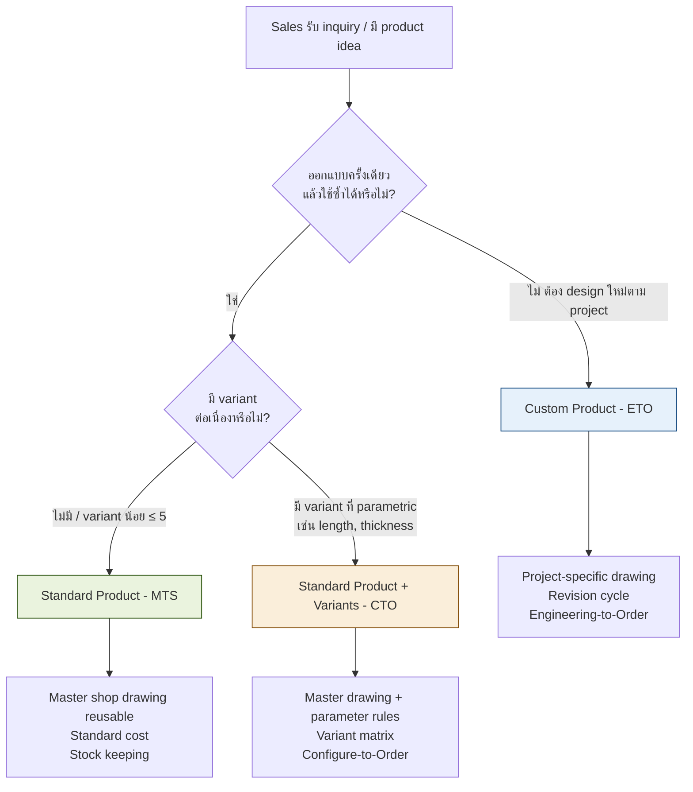
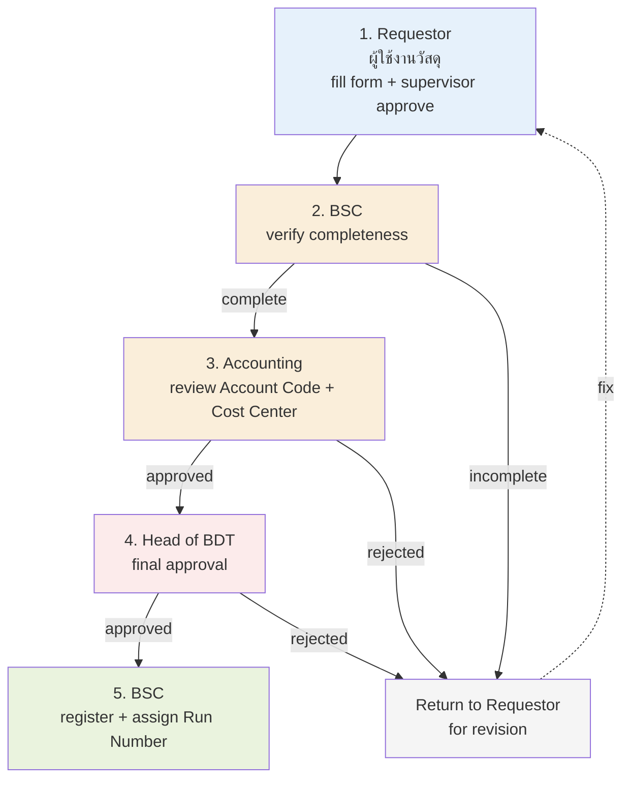
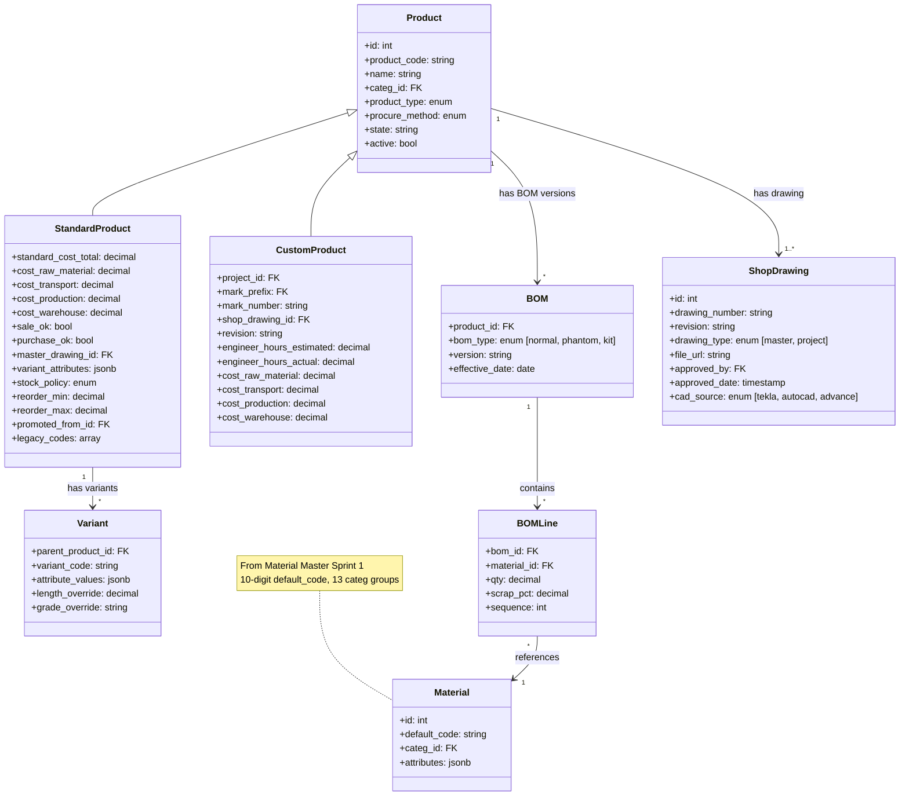
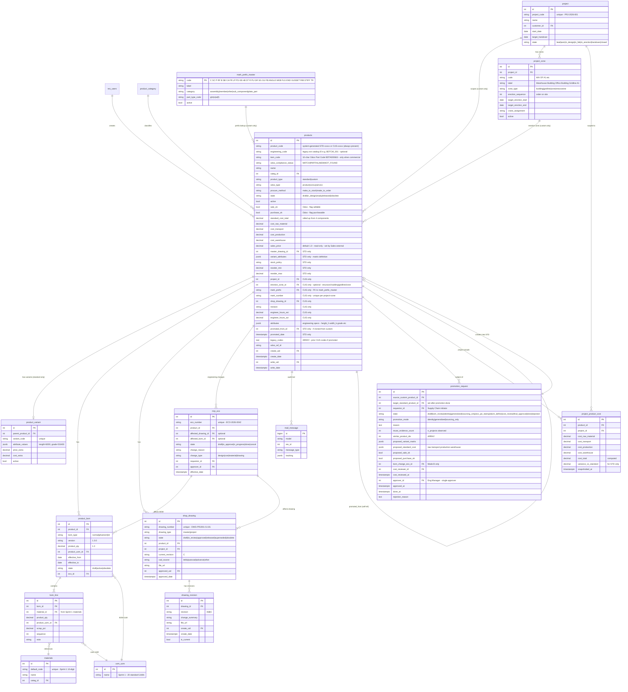
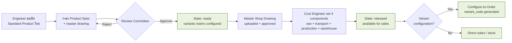
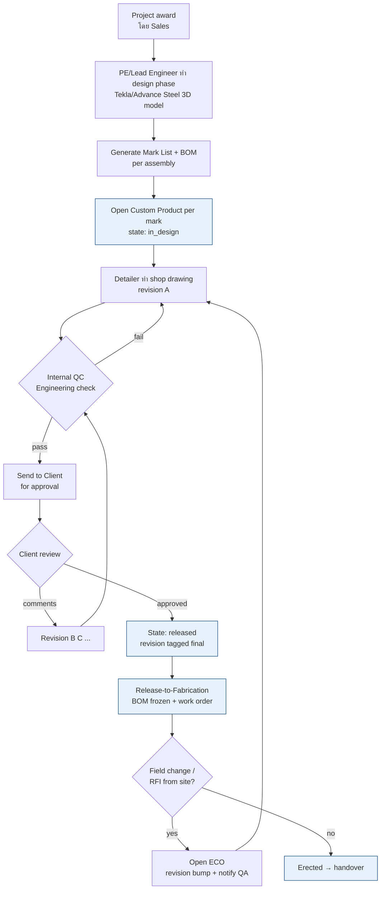
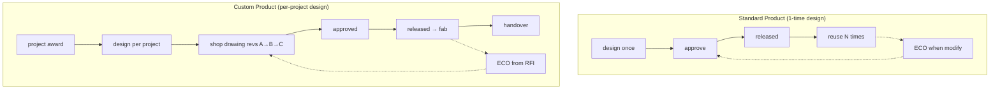
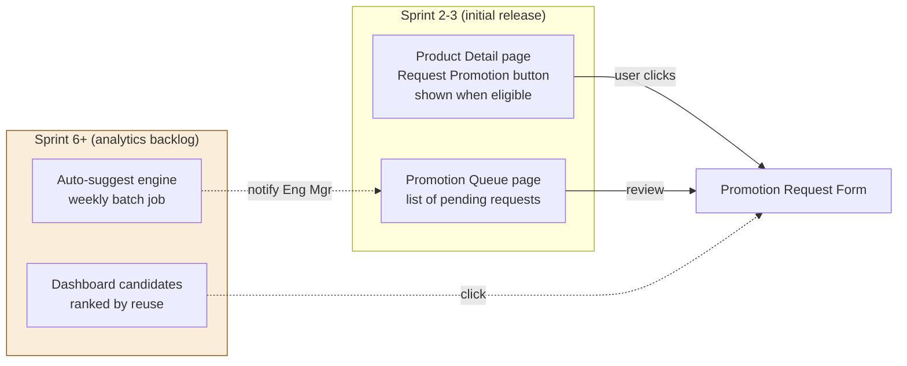
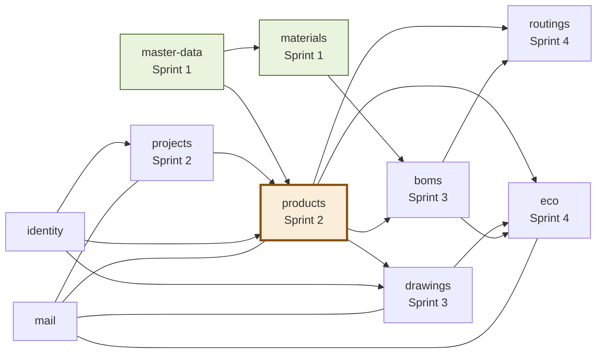
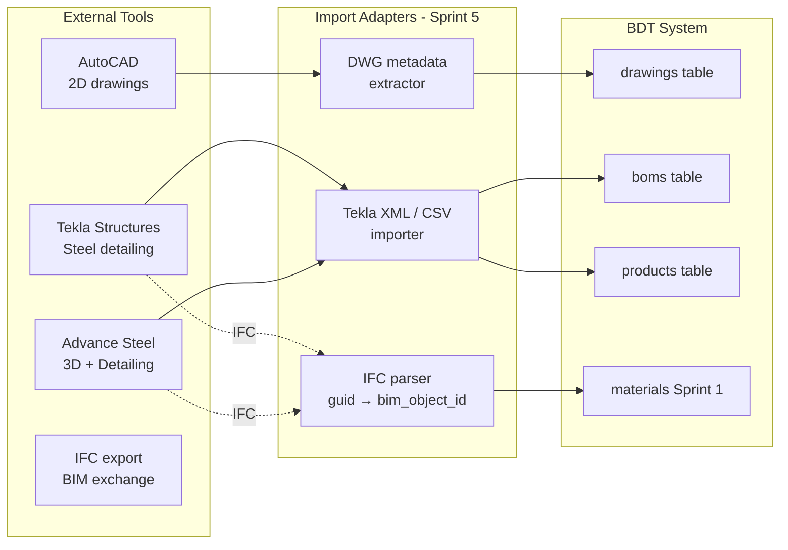

# Standard Product vs Custom Product — System Design

> **Project:** BDT Engineer Management System
> **Layer:** **Product** (deliverable / saleable item) — เลเยอร์เหนือ Material Master
> **Date:** 2026-04-28 (rev 5 — final stakeholder Q&A: erection zone, Z/A-Y substitute, HY370 grade, Tekla mapping seed, promotion UX hybrid, analytics backlog)
> **Companion docs:**
> - [`STANDARDIZE_VS_CUSTOM_ODOO.md`](./STANDARDIZE_VS_CUSTOM_ODOO.md) — ADR ระดับ schema (Material Master)
> - [`SPRINT_PLAN_MATERIAL_MASTER.md`](./SPRINT_PLAN_MATERIAL_MASTER.md) — Sprint 1 (Material Master เสร็จ)
> - [`PROMOTION_LIFECYCLE_DESIGN.md`](./PROMOTION_LIFECYCLE_DESIGN.md) — Deep dive: Custom → Standard promotion
> - [`MICROSERVICES_PLAN.md`](./MICROSERVICES_PLAN.md) — Future architecture (deferred)
>
> **Focus:** Design → Shop Drawing phase (workflow ของ Engineering Department)
>
> **Scope (จากการ confirm ของ stakeholder, cumulative ทุก rev):**
> - ✅ **2 product types only:** standard, custom
> - ✅ Custom can be **promoted** to Standard (Odoo `sale_ok`/`purchase_ok` flags)
> - ✅ **Cost-only system** — ไม่คำนวณราคาขาย; Cost = raw + transport + production + warehouse × 3 levels
> - ✅ Integrate กับ PR / PO / Stock / Inventory เท่านั้น (ไม่ integrate Sales) — Sprint 5–6
> - ✅ Drawing retention: 7 years (AISC compliance)
> - ✅ PE digital stamp = PDF stamped + uploaded
> - ✅ Notification via **email + Teams** (Power Automate webhook — BDT system creates webhook)
> - ✅ **Dual identifier** for Standard Product: `engineering_code` (BDT-internal) + `item_code` (10-char Odoo, only when commercial)
> - ✅ NEW Standard Product registration ต้องตาม **คู่มือ Rev 7** (28-04-2026) — 5-step BSC + Accounting + Head of BDT
> - ✅ Custom→Standard promotion ผ่าน Material Register Form (Eng Mgr single approver) — ถ้าต้องการ commercial registration ต้องทำ Part Code ด้วย (10-char)
> - ✅ ตัวอย่าง 0X202 warehouse project: Tekla output 4 file types (Dispatch, Assembly List, Assembly Part List, Part List)

---

## 1. Executive Summary

ระบบ BDT ในปัจจุบัน (Sprint 1) ทำเสร็จแค่ **Material Master** (ฐาน raw material 13 กลุ่ม) — เลเยอร์ "Product" ที่เป็น **deliverable ส่งให้ลูกค้า** ยังไม่มี เอกสารนี้เสนอ design สำหรับ **Product Layer** ที่แยกเป็น **2 ประเภท** (ตาม master ของ BDT) + กลไก **promotion** Custom → Standard

| | **Standard Product** (MTS / CTO) | **Custom Product** (ETO) |
|---|---|---|
| **ตัวอย่างในธุรกิจ BDT** | Cee Purlin C-200, Paint T-N (Nippon brand variant), Typical Truss T-12, Anchor Bolt Set, Roof Panel | Main Frame Project X, Mark B1/C2 ของอาคารโรงงาน, Custom Canopy |
| **Lifecycle** | Design **ครั้งเดียว** → reuse ทุก project | Design **ใหม่ทุก project** ตาม shop drawing ลูกค้า |
| **BOM** | Fixed master BOM + variant attribute overrides | Generated per project (Tekla / manual) |
| **Shop Drawing** | Master drawing reusable across projects | Project-specific drawing พร้อม revision A→B→C→IFC→AB |
| **Lead time** | ≈ 1–3 วัน (stock/MTS) หรือ ≈ 1–2 สัปดาห์ (CTO build) | ≈ 4–12 สัปดาห์ (engineering + fab + erect) |
| **Cost basis** | `standard_cost` = forecast (raw + transport + production + warehouse) | `actual_cost` per project (4 components, snapshotted) |
| **Sale price** | **ระบบไม่คำนวณ** — ตั้งโดย Sales team external | **ระบบไม่คำนวณ** — ตั้งโดย Sales team external |
| **Trigger** | Replenishment (MTS) / Sales order (CTO) | Project award + shop drawing release |
| **`sale_ok` flag** | true (default) | false (default; can be flagged true via promotion) |
| **`purchase_ok` flag** | varies (paint=false, raw section=true) | false |
| **Origin** | created directly **OR** promoted from a custom that was reused | created per project |

**Promotion path:**
```
Custom (project-specific, sale_ok=false) ──[promotion request + review]──>
  Clone as new Standard (sale_ok=true|false, purchase_ok=true|false)
  Custom ของเดิมยังคงอยู่ใน project history
```

ดูรายละเอียดที่ [`PROMOTION_LIFECYCLE_DESIGN.md`](./PROMOTION_LIFECYCLE_DESIGN.md)

**Design Principle (สอดคล้องกับ ADR เดิม + rev 2 conditions):**
1. **One physical table** `products` — type discriminator + state machine ต่างกัน (Single-Table Inheritance pattern)
2. **Standard = `product.template` + variants ของ Odoo** — schema เลียน Odoo + flags `sale_ok` / `purchase_ok`
3. **Custom = `mrp.production` + `mrp.bom` พร้อม revision** — ใช้ Odoo MTO/MRP pattern + ECO
4. **Shop Drawing เป็น first-class entity** — ทั้ง Standard และ Custom ต้องมี drawing แต่ลำดับการสร้างต่างกัน
5. **Material catalog เดิม (Sprint 1)** ใช้เป็น "raw input" ของ BOM ทั้ง 2 ประเภท
6. **Promotion = Clone, ไม่ใช่ Mutate** — Custom→Standard สร้าง row ใหม่ + link ผ่าน `promoted_from_id` (ดูเหตุผลใน Finding 3 ของ rev-2 critical analysis)
7. **Cost-only system** — เก็บแค่ cost (4 components × 3 levels); sale price อยู่นอกระบบ
8. **Mark prefix master** — BDT มี dictionary ของตัวเอง (C, SC, P, RF, B, SB, ...) เก็บใน master table ไม่ hard-code

---

## 2. Business Analysis

### 2.1 ทำไมต้องแยก Standard vs Custom

ในอุตสาหกรรม Steel Structure (BDT context) — ปัญหาที่เกิดในระบบที่ **ไม่แยก** product type:

| ปัญหา | สาเหตุ | ผลกระทบ |
|---|---|---|
| **Reuse ไม่ได้** — engineer ออกแบบ purlin ซ้ำ ๆ ทุก project | ระบบเก็บทุก product เป็น project-specific หมด | เสียเวลา design 30–40% / margin ลด |
| **Quotation ช้า** | ต้อง engineer take-off ทุกครั้งแม้ของซ้ำ | สูญ opportunity, ลูกค้าไปเจ้าอื่น |
| **MRP ไม่แม่น** | Custom + Standard ปนกัน อยู่ใน flow MTO หมด | คลังเก็บของเกิน / ขาด random |
| **Drawing version ปนกัน** | Master drawing (purlin) แก้แล้วกระทบ project เก่า | Production ผิด spec |
| **Costing เพี้ยน** | Standard ไม่มี standard cost, Custom ไม่มี actual cost tracking | กำไรจริงต่อ project ไม่รู้ |
| **Sales–Engineering ทะเลาะกัน** | Sales รับงาน fast-track ที่ "เคยทำ" — Engineering บอก "ของใหม่" | Project delay / re-work |

### 2.2 Decision Criteria — เมื่อไหร่ควรเป็น Standard / Custom



**Concrete rules ที่ใช้ตัดสิน:**

| เงื่อนไข | Standard | Custom |
|---|:-:|:-:|
| ใช้ในมากกว่า 3 projects ใน 12 เดือน | ✅ | |
| Drawing reuse เป็นหลัก (ลูกค้ายอมตามแบบเรา) | ✅ | |
| ต้อง modify per project (geometry, load, connection) | | ✅ |
| Engineer hours / unit > 8 ชม. | | ✅ |
| มี tolerance ตาม mill/ASTM standard | ✅ | |
| ต้อง stamp PE (Professional Engineer) ต่อ project | | ✅ |

---

## 3. Research / Benchmark

### 3.1 ผังความคิดจาก 3 แหล่ง

| แหล่ง | สิ่งที่ยืม | สิ่งที่ไม่ยืม |
|---|---|---|
| **Odoo ERP** | `product.template` + `product.product` (variants), `mrp.bom`, `mrp.eco`, `procure_method` (`make_to_stock`/`make_to_order`), `mrp.production` (work order), `sale.order.line` linkage | UI components ของ Odoo (web 17 framework) |
| **Siemens Opcenter (MES)** | Genealogy (parent–child traceability per serial), `as-designed` vs `as-built` BOM, ECN (Engineering Change Notice) workflow, work-in-process (WIP) tracking | Heavy MES infrastructure (RTLS, OEE realtime) |
| **Steel Structure Industry (Tekla / AISC / SDI)** | Shop drawing revision cycle (A → B → C revisions), AISC connection details catalog, mark number (piecemark) per fabricated assembly, weight-per-mark, erection sequence | Tekla XML format ตรง ๆ — เราจะ design schema ของเรา + import adapter |

### 3.2 Odoo Procure Method เป็น core concept

Odoo ใช้ field `procure_method` ใน `stock.move` / `mrp.production`:
- `make_to_stock` (MTS) — produce ก่อน sale, มี stock buffer
- `make_to_order` (MTO) — produce หลัง sale, no stock

BDT extension:
| BDT Type | Odoo procure_method | Trigger | Stock policy |
|---|---|---|---|
| Standard Catalog | `make_to_stock` | Demand forecast / replenishment | Min/max stock |
| Standard Configure-to-Order | `make_to_order` | Sales order with variant config | No stock (build ตาม config) |
| Custom Engineering-to-Order | `make_to_order` + ECO required | Project award + shop drawing release | No stock + serialized per project |

### 3.3 Steel-specific concepts ที่ทั้ง Odoo และ MES ไม่มี

| Concept | Definition | ทำไม Odoo/Opcenter ไม่มี |
|---|---|---|
| **Mark Number (Piecemark)** | รหัสประจำชิ้น fabricated เช่น B1, C2, T-101 — printed บน steel + ใช้สำหรับ erection | Odoo เป็น generic manufacturing |
| **Connection Type** | Bolted / Welded / Bearing / Slip-critical | Steel-specific |
| **Erection Sequence** | ลำดับติดตั้งที่หน้างาน (Foundation → Column → Beam → Brace → Purlin → Roof) | งานก่อสร้าง ไม่ใช่ factory MES |
| **Camber / Pre-set** | ค่า deflection เผื่อ load | Steel girder / truss only |
| **Surface Preparation Spec** | SSPC-SP6 / SP10 (sandblast level) | Coating spec |
| **Galvanizing thickness** | μm (HDG) ตาม ASTM A123 | Steel coating |

→ ต้อง custom column / table สำหรับ steel domain

### 3.4 Odoo Production Template (rev 3 — จาก `document/odoo-product-template.xlsx`)

ข้อมูล production จริง 2,688 rows เผยโครงสร้างที่ BDT ใช้กับ Odoo อยู่แล้ว — เป็น **starting point** ของ design:

#### Category Tree ที่มีอยู่จริง

```
All
├── Building Structures
│   ├── MAIN STRUCTURES (12 templates: BEAM, COLUMN, CANOPY, RAFTER, POST, MEZZANINE, RAFTERTRUSS, SUBTRUSS, TRANSFERBEAM/TRUSS, CONNECTIONPLATE)
│   ├── SECONDARY STRUCTURES (8)
│   ├── COMPONENTS (19), COLDFORM (144), CLADDING (82)
├── Steel Accessories (792)
├── Structural Steels / Shape / STEELSHAPE (531)
├── Raw Materials
│   ├── Plate / PLT (504), STEELPLATE (2)
│   └── Hot Roll Coil / HRC (51)
├── Finished Goods / STEELPLATE-FG (20)
├── Saleable                                 ← branch สำหรับ promoted standard ที่ขายได้
│   ├── Steel Structure (4: PEB, TRUSS, ค่าสินค้า)
│   └── Steel Structure and Service (2: Erection, Steel Structure and Erection)
├── Purchase Service (52)                    ← service ที่ BDT ซื้อ (subcontract)
│   ├── FABRICATION, TRANSPORTATION, ERECTION
│   └── Cold form installation, Cutting, Commission, External design
├── Expenses
│   ├── PAINT (94), FIREPROOF (2)
└── Consumable (282)
```

#### Pre-existing Standard Product Templates (12 ตัว) — Sprint 2 starting point

| Odoo Code | Name | Mark Prefix Match (BDT) |
|---|---|---|
| BDTOM01000 | CANOPY | CA |
| BDTOM02000 | BEAM | B |
| BDTOM03000 | COLUMN | C |
| BDTOM04000 | RAFTER | RF |
| BDTOM05000 | RAFTERTRUSS | RF + TR |
| BDTOM06000 | TRANSFERTRUSS | TR |
| BDTOM07000 | TRANSFERBEAM | B (transfer subtype) |
| BDTOM08000 | CONNECTIONPLATE | END / GUSSET |
| BDTOM09000 | SUBTRUSS | TR |
| BDTOM10000 | POST | P |
| BDTOM11000 | MEZZANINE | (gap — เพิ่ม `MZ` prefix?) |
| BDTH000667 | Steel Structure (generic) | – |

→ Sprint 2 seed: import 12 templates เป็น `products` rows + map ไป `mark_prefix_master`

#### Internal Reference Pattern

| Prefix | Usage | Count |
|---|---|---|
| BDT | main BDT-branded items (raw + structures) | 1940 |
| PLT | Plate (raw materials) | 362 |
| BIF | Building Industrial Facility | 286 |
| FIX | Fixed Asset (tools, equipment) | 35 |
| HRC, BHS, BSD, CONEM | niche groups | <10 each |

→ aligns กับ Sprint 1 `default_code CHAR(10)` schema

#### Sales Price + Cost in Odoo

- **Sales Price exists** ใน 2,321 items (median = 1.0 = placeholder default)
- **Cost exists** ใน 111 items (median = 357 baht, range 0.5 – 94K)
- Odoo มี **single `cost` field** — BDT design เก็บ 4 components → **roll-up to single ตอน sync**

→ BDT schema ต้อง add `sales_price NUMERIC DEFAULT 1.0` (read-only, populated by Sales external) เพื่อ Odoo compatibility

#### UoM ที่ใช้จริงใน Odoo (16+ values)

```
EA(1632) KG(610) SET(121) MTR(94) GAL(50) DRM(46) JOB(45) PAK(19) SQM(18)
CN(6) CUM(5) TNN(4) PRJ(4) PR(4) BHT(4) M2(3) D(1)
```

- **BHT** (Baht) — UoM = currency itself (สำหรับ Saleable Steel Structure ขายเป็น lump-sum baht)
- **PRJ** (Project) — UoM = whole project (สำหรับ "ค่าสินค้าโครงสร้างเหล็ก Stock/Consumable" ที่ผูกทั้ง project)
- **TNN** (Tons) — สำหรับ heavy items เช่นหัวตัดแก๊ส

→ Sprint 1 UoM seed (20 items) ครอบคลุมส่วนใหญ่; Sprint 2 ขยายเพิ่ม BHT, PRJ, TNN, PAK, CUM ถ้ายังไม่มี

#### Critical Insight: BDT Product vs Odoo product.template

Odoo เก็บ Material + Product ใน table เดียวกัน (`product.template`); BDT design **แยก 2 tables** (`materials` + `products`)

**ข้อตัดสินใจ (rev 3):**
- ✅ คงการแยก — audit trail ชัด, lifecycle ต่างกัน, Sprint 1 เสร็จแล้ว
- ✅ Odoo sync adapter merge ทั้งสองตารางเข้า single `product.template` ตอน sync
- ✅ ใช้ `categ_id` แยก: BDT materials → "Raw Materials/*" / "Steel Accessories" / "Consumable"; BDT products → "Building Structures/*" / "Saleable/*" / "Finished Goods/*"

### 3.5 คู่มือการจัดการวัสดุ Rev 7 Alignment (rev 4)

จาก `document/คู่มือการจัดการวัสดุ_Rev7_28-04-2026.pdf` — เป็น **authoritative business process** สำหรับ NEW Standard Product/Material registration

#### 3.5.1 Part Code Structure (10 chars, exact per Rev 7 §2.2)

```
Position:   1   2   3   4   5   6   7   8   9   10
            │   │   │   │   │   └────────────────┘
            │ group │  sub  └─ Run Number 5 digits
            │ (3)   │  flag    (by warehouse / BSC)
            └───────┘
            (by Requirement issuer)
```

| Position | Meaning | Set by |
|---|---|---|
| 1-3 | Group prefix (3 letters) — 1 of 20 groups | Requirement issuer |
| 4 | Substitute Flag (Z=Original, A-Y=Substitute) for groups 1-16,18,20<br>OR sub-class digit (1-7) for groups 17,19 | Requirement issuer |
| 5 | Sub-classification per group (e.g., "C" for Coldform Plate, "S" for Steel Structure) | Requirement issuer |
| 6-10 | Run Number (5 digits) | Warehouse / BSC |

#### 3.5.2 20 Group Master Table

| # | Group | Pos 1-5 | Account Code | Sprint 1 Match? |
|---|---|---|---|:-:|
| 1 | Paint | BDTT0 | 67213 | ❌ extend |
| 2 | Plate | BDTP0 | 56515 | ✅ PLATE |
| 3 | Accessories | BDTA0 | 56521 | ✅ ACCESSORY |
| 4 | Hot Roll Shape | BDTH0 | 56521 | ✅ HR_SHAPE |
| 5 | Coldform Shape | BDTC0 | 56524 | ✅ COLDFORM |
| 6 | Building Components | BDTBC | 56525 | ✅ BUILDING_COMP |
| 7 | Steel Structures | BDTSS | 56515 | ✅ (new) |
| 8 | Part Components | BDTPC | 56515 | ❌ extend |
| 9 | Services/Construction | BDTSC | 67299 | ❌ new (service) |
| 10 | Other Services | BDTS0 | 67299 | ❌ new (service) |
| 11 | Hot Roll Coil | BDTHR | 56515 | ✅ COIL |
| 12 | Services/Transportation | BDTST | 66903 | ❌ new (service) |
| 13 | Services/Fabrication | BDTSF | 66122 | ❌ new (service) |
| 14 | Maintenance | BIFM0 | 68161-68144 | ❌ new |
| 15 | Consume | BIFC0 | 56130 | ✅ → Consumable |
| 16 | Measurement Tools | BIFMT | 62411 | ❌ new |
| 17 | Stationary | STA90 | 62401 | ❌ new |
| 18 | Safety | BDTSA(F) | 62405 | ❌ new |
| 19 | Fixed Asset | FIX90 | 91005 | ✅ FIXED_ASSET |
| 20 | Other | BDTO0 | 99999 | ❌ catch-all |

→ Sprint 2 task: **extend product_category seed จาก 13 → 20**

#### 3.5.3 5-Step Approval Workflow (Rev 7 §9 — สำหรับ NEW registration)



| Step | Activity | Responsible | Accountable |
|---|---|---|---|
| 1 | Requestor fills form + supervisor approve | ผู้ใช้งานวัสดุ | หัวหน้าฝ่ายต้นสังกัด |
| 2 | Verify completeness | BSC (delegated) | หัวหน้า BSC |
| 3 | Review Account Code + Cost Center | ฝ่ายบัญชี | หัวหน้าบัญชี |
| 4 | Final approval | Head of BDT | Head of BDT |
| 5 | Register + assign Run Number 5 digits | BSC | หัวหน้า BSC |

**สำคัญ:** workflow นี้ **ต่างจาก promotion workflow** (Eng Manager single approver):
- 5-step Rev 7 = **business process ของบริษัท** สำหรับ new registration (Accounting + Head of BDT involved)
- Promotion (Eng Mgr) = **technical reuse decision** สำหรับ Custom→Standard
- หาก promoted product ต้องการ commercial item code → ส่งต่อเข้า 5-step Rev 7 workflow

#### 3.5.4 Dual Identifier — Engineering Code vs Item Code

จาก `document/Standard Part - Standardized.xlsx` พบรูปแบบจริง:

| BDTCM (Engineering) | BDTA (Item Code) | Status | Meaning |
|---|---|---|---|
| BDTCM_001 (Washer Hillside) | BDTA000663 | **MATCH** | ทั้ง engineering + commercial |
| BDTCM_002 (Washer M16, same size) | BDTA000663 | **MATCH** | Common Part — รวมเข้า code เดียว |
| BDTCM_005 (Washer 80x80 M27) | – | **NEW** | engineering ใช้แต่ยังไม่มี commercial item code (ขออนุมัติ Run Number) |
| BDTCM_018 (Base plate 20-500x500) | – | **NOT FOUND** | engineering catalog เท่านั้น |

**Three distinct identifiers (no overlap):**

| Field | Purpose | Example | Always present? |
|---|---|---|---|
| `product_code` | System-generated internal BDT ID | `STD-00253`, `CUS-00873` | ✅ always (system-set) |
| `engineering_code` | Legacy external engineering catalog ID (Standard Part PDF, BDT internal docs) | `BDTCM_001` | ❌ optional (only ที่ legacy เคยมี) |
| `item_code` | Odoo-compliant 10-char Part Code | `BDTA000663` | ❌ only when commercial (sale_ok OR purchase_ok = true) |

**Schema implication:**
```sql
-- Sprint 2 products table extension
ALTER TABLE products
  ADD COLUMN engineering_code VARCHAR(20),     -- e.g., 'BDTCM_001' from legacy Standard Part catalog
  ADD COLUMN item_code CHAR(10),                -- 10-char Odoo Part Code (NULL until commercial)
  ADD COLUMN odoo_compliance_status VARCHAR(20) -- 'MATCH'|'PARTIAL'|'NEW'|'NOT_FOUND'
    DEFAULT 'NEW';

-- Constraint: item_code required when commercial — but Custom Product never has item_code
-- (Custom product = project-specific; promotion to Standard creates new STD with item_code)
ALTER TABLE products ADD CONSTRAINT chk_item_code_required CHECK (
  product_type = 'custom'                     -- Custom never has item_code
  OR (sale_ok = false AND purchase_ok = false) -- Standard non-commercial OK to skip
  OR item_code IS NOT NULL                     -- Standard commercial must have item_code
);

-- engineering_code is unique when set (allows multiple NULL)
CREATE UNIQUE INDEX idx_products_eng_code ON products(engineering_code) WHERE engineering_code IS NOT NULL;
```

#### 3.5.5 Standard Part จริง (32 รายการจาก Standardized workbook)

ตัวอย่าง:
```
WASHER 50X50X8_HY370   BDTA000663  (MATCH — commercial)
WASHER 70X70X8_HY370   BDTA000665  (MATCH)
FLY-BRACE 50X50X5_HY370 BDTA000666 (MATCH)
WASHER 80X80X8_HY370   ?            (NEW — awaiting Run Number)
CLEAT 75X145X8_HY370    ?            (NEW)
BACK-UP-PLATE 100X80X6_HY370 ?      (NEW)
INSERT-PLATE 200X200X10_HY370 ?     (NEW)
BASE-PLATE 500X500X16_HY370 ?       (NEW)
FLAT-BAR 150X5_HY370    ?            (NEW — split จาก BDTCM_019)
...
```

**Naming pattern:** `{TYPE} {W}X{H}X{T}_{GRADE}` (e.g., `WASHER 50X50X8_HY370`)

→ ต้องเพิ่ม HY370 ใน steel_grade master (high-yield 370 MPa, JIS G3106 SM490YB equivalent)

### 3.6 Tekla Import Adapter (จาก 0X202 real example)

**4 file types ที่ Tekla export:**
1. `*Dispatch Note*.xls` — site delivery list
2. `*Assembly List*.xls` — top-level assemblies (e.g., COLUMN WH-CO-1)
3. `*Assembly Part List*.xls` — sub-parts (WEB, FLG, plates) within assemblies
4. `*Part List*.xls` — individual parts (cutting list)

**Mark naming format:** `{ZoneCode}-{TeklaType}-{Sequence}` e.g., `WH-CO-1`
- WH = `erection_zone.code` (structural identifier — Warehouse Building) — see §3.8
- CO = Tekla type code (Column) — mapped to BDT mark_prefix "C" via tekla_prefix_mapping (§3.9)
- 1 = sequence number → stored in `mark_number`

**Tekla type → BDT prefix mapping (required adapter):**

| Tekla type | BDT mark_prefix | Note |
|---|---|---|
| CO | C (Column) | 1:1 |
| BE | B (Beam) | inferred |
| RA | RF (Rafter) | – |
| FB | FB (Fly Brace) | 1:1 |
| w (lowercase) | WEB | sub-component |
| f (lowercase) | FLG | sub-component |
| ... | ... | full mapping in seed data |

**Profile format:** `PL6x850` (Plate 6mm × 850mm), `L50x50x5` (Angle 50×50×5)

→ Sprint 5 **Tekla Adapter** parses 4 files + creates Custom Products + BOM hierarchy + Mark mappings

### 3.7 Compliance Status Audit (legacy data cleanup)

จาก `Odoo Compliance vs Manual Rev7.xlsx` พบ **gaps ใน 2,688 legacy items:**

| Issue | Count | % | Severity |
|---|---|---|---|
| Part Code ≠ 10 chars | 712 | 26.5% | MAJOR |
| Prefix non-compliant (PLT-, FIX81, BIF81) | 721 | 26.8% | MAJOR |
| Description has Thai | 1,081 | 40.2% | MAJOR |
| Description not UPPERCASE | 1,765 | 65.7% | MAJOR |
| Grade not specified | 2,125 | 79.1% | MAJOR |
| Unit non-standard (JOB/SQM/CUM/TNN/PRJ/BHT/M2) | 84 | 3.1% | MINOR |
| No Category | 22 | 0.8% | MINOR |
| Category = 'All' top-level | 54 | 2.0% | MINOR |

→ Sprint 4–5 ต้องมี **migration tool** สำหรับ legacy cleanup; new entries blocked at form (Sprint 1 validators ยังถูก)

### 3.8 Erection Zone — First-Class Concept (rev 5)

จาก stakeholder Q5 rev-4 — "WH" prefix ใน "WH-CO-1" **ไม่ใช่แค่ project shortcode** แต่เป็น **structural identifier** สำหรับ erection sequence

**3 zone_types ที่เป็นไปได้:**
| Type | Use case | Example |
|---|---|---|
| `building` | แยก building ใน multi-building project | "WH" (Warehouse), "OF" (Office) |
| `gridline` | ตำแหน่งใน structural grid | "A1", "B3" (column on gridline A1) |
| `zone` | erection zone / sub-area | "Zone1", "North Wing" |
| `mezzanine` | ชั้นลอย | "MZ1", "MZ2" |

**Schema:**

```sql
CREATE TABLE project_zone (
  id                       SERIAL PRIMARY KEY,
  project_id               INT NOT NULL REFERENCES project(id),
  code                     VARCHAR(20) NOT NULL,        -- 'WH', 'OF', 'A1'
  label                    VARCHAR(80) NOT NULL,        -- 'Warehouse Building'
  zone_type                VARCHAR(20) NOT NULL,        -- 'building'|'gridline'|'zone'|'mezzanine'
  erection_sequence        INT,                          -- order on site
  target_erection_start    DATE,
  target_erection_end      DATE,
  crane_assignment         VARCHAR(60),
  notes                    TEXT,
  active                   BOOLEAN NOT NULL DEFAULT true,
  UNIQUE(project_id, code)
);

ALTER TABLE products
  ADD COLUMN erection_zone_id INT REFERENCES project_zone(id);
-- Custom only — null for Standard products
```

**Tekla mark mapping เปลี่ยน:**

```
Tekla mark "WH-CO-1"
  ├── erection_zone.code = "WH" (nullable — only if structural prefix exists)
  ├── mark_prefix = "C" (FK to mark_prefix_master, mapped from Tekla "CO")
  └── mark_number = "1"

UNIQUE constraint: (project_id, erection_zone_id, mark_prefix, mark_number)
-- if no erection_zone, NULL behavior allows different zones to share marks
```

**Erection sequence query example:**

```sql
-- Get all custom products in erection order for project 7
SELECT p.product_code, p.name, pz.code AS zone, p.mark_prefix, p.mark_number
FROM products p
JOIN project_zone pz ON pz.id = p.erection_zone_id
WHERE p.project_id = 7
  AND p.product_type = 'custom'
ORDER BY pz.erection_sequence, p.mark_prefix, p.mark_number;
```

→ **Erection planning = future feature** that builds on this schema (Sprint 7 Site Erection app per roadmap §11)

### 3.9 Tekla Type → BDT Prefix Mapping (rev 5 initial seed)

จาก 0X202 actual + Sheet "Engineer" — **initial mapping** (ขอ confirm ทั้งหมดจาก Engineering team Sprint 5):

| Tekla Type | BDT mark_prefix | Confidence | Source |
|---|---|---|---|
| CO | C (Column) | High | 0X202 actual |
| BE | B (Beam) | Medium | inferred |
| SBE | SB (Sub Beam) | Medium | inferred |
| RA | RF (Rafter) | Medium | inferred |
| TR | TR (Truss) | High | direct |
| FB | FB (Fly Brace) | High | 0X202 actual |
| VB | VB (Vertical Brace) | High | direct |
| HB | HB (Horizontal Brace) | High | direct |
| PU | PU (Purlin) | High | direct |
| GR | GR (Girt) | High | direct |
| PO | P (Post) | Medium | inferred |
| MZ | MZ (Mezzanine) | New | rev-3 Q3 |
| CN | CA (Canopy) | Low | inferred |
| FR | FR (Frame) | High | direct |
| ST | ST (Stair) | High | direct |
| **w** (lowercase) | WEB | High | 0X202 actual |
| **f** (lowercase) | FLG (Flange) | High | 0X202 actual |
| EP | END (End plate) | Medium | inferred |
| GP | GUSSET | Medium | inferred |
| RP | RIB | Medium | inferred |
| SP | STIFF | Medium | inferred |

**Sprint 5 task:** Engineering team confirms full mapping; load as seed in `tekla_prefix_mapping` table:

```sql
CREATE TABLE tekla_prefix_mapping (
  tekla_type       VARCHAR(10) PRIMARY KEY,
  bdt_mark_prefix  VARCHAR(10) NOT NULL REFERENCES mark_prefix_master(code),
  confidence       VARCHAR(10) NOT NULL,  -- 'high'|'medium'|'low'
  source           VARCHAR(80),            -- 'verified-by-engineering' | 'inferred'
  notes            TEXT
);
```

---

## 4. Conceptual Model — Product Taxonomy



### 4.1 ทำไมใช้ Single-Table Inheritance (ไม่แยก 2 ตาราง)

| Approach | ข้อดี | ข้อเสีย |
|---|---|---|
| **A. Two tables** (`standard_products`, `custom_products`) | Schema clean ต่อ type | Query รวม (รายงาน, search) ต้อง UNION; FK จาก BOM/Drawing ต้อง polymorphic |
| **B. Single table + discriminator** (Recommended) | 1 ตาราง 1 product_code, FK ตรง, query ง่าย, Odoo ทำแบบนี้ | บางคอลัมน์ nullable ตาม type |
| C. STI + sub-tables 1-to-1 | Compromise | Complex join, performance hit |

**เลือก B** — match Odoo `product.template` (มีทั้ง stock + service ใน table เดียว ใช้ `type` field) และ match Sprint 1 pattern (`materials` table ใน schema เดียว)

### 4.2 Field nullability rule

```
Common (NOT NULL): id, product_code, name, categ_id, product_type, odoo_type, state, sale_ok, purchase_ok, create_uid, create_date, write_uid, write_date

Cost components (NOT NULL on transition to state='ready' or beyond):
- cost_raw_material, cost_transport, cost_production, cost_warehouse
- standard_cost_total = computed (sum of 4)

Standard-only (NOT NULL when product_type='standard', else NULL):
- master_drawing_id  (nullable when odoo_type IN ('consu','service') — traded items)
- stock_policy

Custom-only (NOT NULL when product_type='custom', else NULL):
- project_id
- mark_prefix (FK → mark_prefix_master)
- mark_number
- shop_drawing_id
- revision

Promotion-only (NOT NULL when product_type='standard' AND created via promotion):
- promoted_from_id  (→ products(id), the source custom)
- promoted_date
- legacy_codes (TEXT[])

Validation: enforce ผ่าน CHECK constraint + service-layer validator
```

---

## 5. Data Model (ERD)

### 5.1 Full ER Diagram



### 5.2 Key constraints (CHECK)

```sql
-- products table check constraints (rev 2)
ALTER TABLE products ADD CONSTRAINT chk_product_type_fields CHECK (
  (product_type = 'standard' AND
     standard_cost_total IS NOT NULL AND
     master_drawing_id IS NOT NULL AND  -- nullable for traded standards (paint, bolts) — see exception below
     project_id IS NULL AND
     mark_number IS NULL AND
     mark_prefix IS NULL)
  OR
  (product_type = 'custom' AND
     project_id IS NOT NULL AND
     mark_number IS NOT NULL AND
     mark_prefix IS NOT NULL AND
     shop_drawing_id IS NOT NULL AND
     promoted_from_id IS NULL AND        -- custom can't be promoted FROM another product
     master_drawing_id IS NULL)
);

-- Exception for traded standards (Odoo type='consu' or paint/bolt): no master drawing required
ALTER TABLE products ADD CONSTRAINT chk_master_drawing_required CHECK (
  product_type != 'standard'
  OR master_drawing_id IS NOT NULL
  OR odoo_type IN ('consu', 'service')   -- traded items skip drawing requirement
);

-- product_code prefix matches type
ALTER TABLE products ADD CONSTRAINT chk_product_code_prefix CHECK (
  (product_type = 'standard' AND product_code LIKE 'STD-%')
  OR
  (product_type = 'custom' AND product_code LIKE 'CUS-%')
);

-- Custom product mark unique within project + zone (rev 5)
-- NULL erection_zone_id treated distinct via NULLS NOT DISTINCT (PG 15+)
-- For PG <15: use partial indexes split by zone IS NULL
CREATE UNIQUE INDEX idx_custom_mark_per_project_zone
  ON products(project_id, COALESCE(erection_zone_id, 0), mark_prefix, mark_number)
  WHERE product_type = 'custom';

-- Promotion link only valid Standard ← Custom
ALTER TABLE products ADD CONSTRAINT chk_promotion_direction CHECK (
  promoted_from_id IS NULL
  OR product_type = 'standard'
);

-- sale_ok / purchase_ok constraint — at least one true if state=released (otherwise pointless to release)
ALTER TABLE products ADD CONSTRAINT chk_released_flag CHECK (
  state != 'released'
  OR sale_ok = true
  OR purchase_ok = true
  OR product_type = 'custom'   -- custom released for fab doesn't need sale/purchase
);
```

### 5.3 Mapping เข้า Odoo (เผื่อ migrate)

| BDT column | Odoo equivalent | Notes |
|---|---|---|
| `products.product_code` | `product.template.default_code` | |
| `products.product_type` | `product.template.type` (extend) | Odoo มี `consu`/`product`/`service` — เพิ่ม `standard`/`custom` |
| `products.procure_method` | `stock.warehouse.orderpoint.product_id` policy | |
| `products.standard_cost_total` | `product.template.standard_price` | BDT computes from 4 components; Odoo stores rolled value |
| `products.sale_ok` | `product.template.sale_ok` | direct |
| `products.purchase_ok` | `product.template.purchase_ok` | direct |
| `products.odoo_type` | `product.template.type` | values: product / consu / service |
| `products.standard_cost` | `product.template.standard_price` | direct |
| `product_variant.attribute_values` | `product.product.product_template_attribute_value_ids` | |
| `product_bom.*` | `mrp.bom` | direct |
| `bom_line.*` | `mrp.bom.line` | direct |
| `mrp_eco.*` | `mrp.eco` | direct |
| `shop_drawing` | (ไม่มีตรง — ใช้ `ir.attachment` + custom model) | needs Odoo addon |

---

## 6. Workflow Design — Design → Shop Drawing

### 6.1 Standard Product Track



**Key transitions (state machine):**

```
draft → in_design → ready → released → obsolete
                       ↓                 ↑
                     reject ←──── modify (ECO required)
```

**Master drawing rule:** drawing-revision เกิดจาก ECO เท่านั้น (ห้าม edit drawing ตรง ๆ ใน state `released`)

### 6.2 Custom Product Track



**State machine:**

```
                  ┌──── reject ────┐
                  ↓                │
draft → in_design → in_review → approved → released → in_fab → erected → handover
            ↑                                  │
            └────── ECO opens revision ────────┘
```

### 6.3 Comparison side-by-side



### 6.4 Drawing Revision Convention (AISC / Tekla practice)

| Revision | Stage | Approver |
|---|---|---|
| `0` (or `A`) | Internal first issue (ภายใน engineering) | Lead Engineer |
| `A` (or `B`) | First issue to client / construction | PE stamp + Project Manager |
| `B`, `C`, ... | Subsequent revisions per RFI / change | PE re-stamp |
| `IFC` | Issued for Construction (ลง field) | Construction Manager + PE |
| `AB` | As-Built | Site QA |

**Revision policy:**
- Standard product: revisions อยู่ใน master_drawing — ทุก revision = new ECO
- Custom product: revisions อยู่ใน project shop drawing — เลข revision per drawing, ไม่ผูกกับ ECO ในรอบ design phase แต่ผูกกับ ECO หลัง released

### 6.5 Promotion UX (rev 5 — hybrid recommendation)

3 entry points (Sprint 2-3 initial release + Sprint 6+ analytics):



**3 entry points:**

| Entry | When visible | Use case |
|---|---|---|
| **Inline button on Product Detail** | Custom Product, state=`released`, role ∈ {Eng Mgr, SC, Eng} | Quick promote when reviewing the product |
| **Promotion Queue page** | Always (Eng Mgr role) | Strategic batch review of pending requests |
| **Analytics suggestions** (Sprint 6+) | Weekly digest + dashboard widget | "5 candidates this quarter — design stable, ≥3 projects" |

**Eligibility for "Request Promotion" button to appear:**
- `product_type = 'custom'`
- `state = 'released'` (≥1 ECO cycle complete)
- has cost data (≥1 entry in `project_product_cost`)
- no existing `promotion_request` in non-terminal state for this product

**Backlog: BDT-ANALYTICS-001 "Promotion Similarity Engine" (Sprint 6+):**
- Weekly batch query — group custom products by signature (categ + mark_prefix + clustered attributes <0.5mm)
- Threshold: ≥3 use_count, no recent ECO, has cost data
- Notify Eng Mgr via email + Teams webhook
- Future: ML similarity (vector embedding of `name` + numeric attrs via sentence-transformer)

### 6.6 RACI ของ workflow

| Activity | Sales | Project Mgr | PE / Lead Eng | Detailer | Reviewer | Client | Production | Site |
|---|:-:|:-:|:-:|:-:|:-:|:-:|:-:|:-:|
| **Standard** product proposal | C | I | R | C | A | I | I | – |
| Master drawing creation | – | – | A | R | C | – | I | – |
| Standard cost setup | C | – | C | – | A | – | I | – |
| Variant configuration | R | – | C | – | A | – | I | – |
| **Custom** project award | A | R | C | – | – | I | I | – |
| Custom 3D model | – | I | A | R | C | – | – | – |
| Shop drawing rev A | – | I | A | R | C | – | – | – |
| Client review submission | I | R | A | – | – | C | – | – |
| ECO from RFI | – | C | A | R | C | I | I | I |
| Release to fab | – | A | C | – | – | I | R | – |
| As-built | – | C | I | C | A | I | – | R |

> **R** = Responsible / **A** = Accountable / **C** = Consulted / **I** = Informed

---

## 7. Module Breakdown

### 7.1 NestJS Module (Modular Monolith — ต่อยอดจาก Sprint 1)

```
backend/src/modules/
├── identity/                          # 🟦 (มีอยู่ Sprint 1)
├── master-data/                       # 🟦 (มีอยู่ Sprint 1)
├── materials/                         # 🟦 (มีอยู่ Sprint 1) — Material Master 13 groups
├── mail/                              # 🟦 (มีอยู่ Sprint 1) — audit
│
├── projects/                          # 🟥 NEW — Sprint 2
│   ├── projects.controller.ts
│   ├── projects.service.ts
│   ├── projects.module.ts
│   └── dto/
│
├── products/                          # 🟦/🟨/🟥 NEW — Sprint 2 (CORE ของเอกสารนี้)
│   ├── dto/
│   │   ├── create-standard-product.dto.ts
│   │   ├── create-custom-product.dto.ts
│   │   └── update-product.dto.ts
│   ├── validators/
│   │   ├── product-type.validator.ts          # 🟥 enforce nullability rule
│   │   ├── product-code.generator.ts          # 🟥 STD-xxxxx / CUS-xxxxx
│   │   └── variant-config.validator.ts        # 🟨 variant attribute schema
│   ├── products.controller.ts                 # GET/POST/PATCH /products
│   ├── products.service.ts                    # discriminator-aware
│   ├── products.state-machine.ts              # 🟦 standard + custom states
│   └── products.module.ts
│
├── boms/                              # 🟦 NEW — Sprint 3 (mrp.bom + mrp.bom.line)
│   ├── boms.controller.ts
│   ├── boms.service.ts                # link bom_line.material_id → Sprint 1 materials
│   └── bom-explosion.service.ts       # explode BOM → cutting list
│
├── drawings/                          # 🟥 NEW — Sprint 3 (steel-specific)
│   ├── drawings.controller.ts
│   ├── revisions.controller.ts
│   ├── drawings.service.ts
│   └── drawing-rev.state-machine.ts   # A → B → C → IFC → AB
│
├── eco/                               # 🟦 NEW — Sprint 4 (mrp.eco pattern)
│   └── ...
│
└── routings/                          # 🟦 NEW — Sprint 4 (mrp.routing + work_center)
    └── ...
```

### 7.2 Module dependency graph



### 7.3 Standard / Hybrid / Custom tag per module

| Module | Tag | สัดส่วน Standard:Hybrid:Custom |
|---|:-:|---|
| projects | 🟨 Hybrid | 60 : 30 : 10 — Odoo `project.project` + steel project lifecycle states |
| products | 🟦 Standard + 🟥 Custom (steel-specific fields) | 60 : 20 : 20 |
| boms | 🟦 Standard | 90 : 5 : 5 — `mrp.bom` 1:1 |
| drawings | 🟥 Custom (Odoo ไม่มี) | 5 : 15 : 80 |
| eco | 🟦 Standard | 85 : 10 : 5 — `mrp.eco` 1:1 |
| routings | 🟦 Standard + 🟥 work_center steel-specific | 70 : 15 : 15 |

---

## 8. API Contracts (Sprint 2 deliverables)

### 8.1 Products

```http
# ── Create Standard Product (Fabricated) ──
POST /api/v1/products
Body: {
  "product_type": "standard",
  "odoo_type": "product",                   # Odoo type — product=storable, consu=traded, service
  "name": "Cee Purlin C-200×75×20×2.3 SS400",
  "categ_id": 14,                           # BUILDING_COMP / Cee Purlin sub
  "sale_ok": true,                          # ขายปลีกให้ contractor ได้
  "purchase_ok": false,                     # ผลิตเอง
  "cost_raw_material": 480.00,
  "cost_transport":      35.00,
  "cost_production":    100.00,
  "cost_warehouse":      25.00,
  # standard_cost_total = 640.00 (computed)
  "stock_policy": "min_max",
  "reorder_min": 100,
  "reorder_max": 500,
  "variant_attributes": {                   # variant matrix definition
    "length": [3000, 6000, 9000],
    "thickness": [2.3, 3.2]
  },
  "master_drawing_ref": "DWG-MASTER-CP200"  # → creates ShopDrawing(type=master)
}
→ 201 { product_code: "STD-00142", state: "draft", ... }

# ── Create Standard Product (Traded — paint) ──
POST /api/v1/products
Body: {
  "product_type": "standard",
  "odoo_type": "consu",                     # traded item, no stock tracking required
  "name": "Paint Topcoat Nippon TUC-100",
  "categ_id": 1,                            # Paint group
  "sale_ok": true,
  "purchase_ok": true,                      # ซื้อจาก supplier + ขายต่อ
  "cost_raw_material": 350.00,              # bought price
  "cost_transport":      8.00,
  "cost_production":     0.00,              # no production
  "cost_warehouse":     12.00,
  "variant_attributes": { "brand": ["Chugoku","Nippon","Beger","Dulux","Bitec","Starfire"] }
  # master_drawing_ref omitted — odoo_type='consu' allows null drawing
}

# ── Create Custom Product ──
POST /api/v1/products
Body: {
  "product_type": "custom",
  "project_id": 7,
  "mark_prefix": "B",                       # FK → mark_prefix_master (Beam)
  "mark_number": "1",
  "name": "Main Beam B1 - Truss A1 Project Factory X",
  "categ_id": 9,                           # HR_SHAPE / Main beam
  "shop_drawing_ref": "DWG-PRJ007-B1",
  "engineer_hours_est": 16
}
→ 201 { product_code: "CUS-00873", state: "draft", ... }

# ── State transitions ──
POST /api/v1/products/:product_code/action_submit_design     # draft → in_design
POST /api/v1/products/:product_code/action_review            # in_design → in_review
POST /api/v1/products/:product_code/action_approve           # in_review → approved
POST /api/v1/products/:product_code/action_release           # approved → released
POST /api/v1/products/:product_code/action_obsolete          # released → obsolete
POST /api/v1/products/:product_code/action_open_eco          # released + open ECO

# ── Search ──
GET /api/v1/products?product_type=standard&state=released&q=purlin&page=1&limit=20
GET /api/v1/products?product_type=custom&project_id=7
GET /api/v1/products/:product_code
GET /api/v1/products/:product_code/messages                 # audit log
```

### 8.2 BOMs

```http
POST /api/v1/products/:product_code/boms
Body: {
  "bom_type": "normal",
  "version": "1.0.0",
  "product_qty": 1.0,
  "product_uom_id": 6,                     # KG
  "lines": [
    { "material_default_code": "0900100012", "qty": 12.5, "uom_id": 6, "scrap_pct": 3 },
    { "material_default_code": "1100200015", "qty": 4,    "uom_id": 1, "scrap_pct": 0 }
  ]
}

GET /api/v1/products/:product_code/boms                     # list versions
GET /api/v1/boms/:bom_id/explode                            # flatten + scrap calc
POST /api/v1/boms/:bom_id/action_activate                   # draft → active (deactivate previous)
```

### 8.3 Shop Drawings

```http
POST /api/v1/drawings
Body: {
  "drawing_type": "project",               # or "master"
  "product_code": "CUS-00873",
  "project_id": 7,                         # null if master
  "drawing_number": "DWG-PRJ007-B1",
  "cad_source": "tekla",
  "file_url": "s3://..../DWG-PRJ007-B1-rev0.pdf"
}

POST /api/v1/drawings/:drawing_id/revisions
Body: {
  "revision": "A",
  "change_summary": "First issue to client",
  "file_url": "s3://..../DWG-PRJ007-B1-revA.pdf"
}

POST /api/v1/drawings/:drawing_id/action_approve            # approves current revision
POST /api/v1/drawings/:drawing_id/action_supersede          # current → superseded (when new revision)
GET  /api/v1/drawings/:drawing_id/revisions                 # full history
```

### 8.4 ECO

```http
POST /api/v1/eco
Body: {
  "product_code": "STD-00142",
  "change_reason": "Client requested thicker web for higher load",
  "change_type": "design"
}
→ creates eco_number "ECO-2026-0042" + state=draft

POST /api/v1/eco/:eco_number/action_submit                  # draft → to_approve
POST /api/v1/eco/:eco_number/action_approve                 # to_approve → in_progress
POST /api/v1/eco/:eco_number/action_done                    # in_progress → done (apply changes)
```

---

## 9. Integration Points

### 9.1 Internal (within BDT system)

| Source | Target | Pattern | Sprint |
|---|---|---|---|
| `materials` (Sprint 1) | `bom_line.material_id` | FK | 3 |
| `products.master_drawing_id` | `shop_drawing.id` | FK | 2 |
| `products.shop_drawing_id` | `shop_drawing.id` | FK | 2 |
| `eco.product_id` | `products.id` | FK + state hook | 4 |
| `routing.product_id` | `products.id` | FK | 4 |

### 9.2 External CAD / BIM



**Tekla integration approach:**
- Phase 1 (Sprint 5): manual upload of Tekla XML → parse mark list + BOM → auto-create custom products + boms
- Phase 2 (Sprint 7+): live Tekla Open API (REST) → sync periodically
- Mark number = Tekla "Phase + Position number"

### 9.3 Odoo (future migration target)

| BDT entity | Odoo target | Migration approach |
|---|---|---|
| `products` (standard) | `product.template` + `product.product` | XML-RPC `create()` 1:1 (`default_code` = `product_code`) |
| `products` (custom) | `product.template` (type='consu', track_service=True) per project | Same pattern, extra `project_id` (Odoo `project.project`) |
| `product_variant` | `product.attribute` + `product.attribute.value` + `product.template.attribute.line` | Mapping required |
| `product_bom` | `mrp.bom` | direct |
| `bom_line` | `mrp.bom.line` | direct |
| `mrp_eco` | `mrp.eco` | direct |
| `shop_drawing` | `ir.attachment` + custom `bdt.shop.drawing` model | Odoo addon needed |
| `project` | `project.project` | direct |

### 9.4 Other systems

| System | Direction | Purpose | Sprint |
|---|---|---|---|
| Procurement (PO system / Odoo) | BDT → ERP | When BOM released, create PO requisition for materials not in stock | 5 |
| Production (Siemens Opcenter / MES) | BDT → MES | Released products + BOM + routing → work order in MES | 6 |
| Accounting (Odoo Finance) | BDT → ERP | Standard cost setup, project cost tracking | 5 |
| Site Erection App (mobile) | BDT ↔ App | Mark numbers + erection sequence + as-built feedback | 7 |

---

## 10. Key Use Cases (Step-by-Step)

### UC-1: Engineer ขอเปิด Standard Product ใหม่ (Cee Purlin)

| # | Actor | Action | System | State |
|---|---|---|---|---|
| 1 | Engineer | กด "New Product" → เลือก type=standard | UI form | – |
| 2 | Engineer | กรอก name, categ, sale_ok/purchase_ok flags, variant matrix | Validate (Zod) | – |
| 3 | Engineer | Upload master drawing (PDF + Tekla file) | `shop_drawing` (type=master) created | drawing.draft |
| 4 | System | Generate `product_code` = "STD-00142" | products row created | products.draft |
| 5 | Engineer | กด "Submit for Design Review" | Transition | products.in_design |
| 6 | Reviewer | Open product detail → review → กด "Approve" | check drawing + variants | products.in_review → approved |
| 7 | Cost Engineer | Set 4 cost components (raw + transport + production + warehouse); standard_cost_total auto-computed | – | products.approved |
| 8 | PE | Stamp drawing → กด "Release" | drawing.approved + products.released | products.released |
| 9 | – | Product visible to PR/PO/Stock systems (sale_ok/purchase_ok flags drive routing) | mail_message logs all transitions | – |

### UC-2: Custom Product per project (Main Beam B1 ของ Project X)

| # | Actor | Action | System | State |
|---|---|---|---|---|
| 1 | Sales | Project award → create project "PRJ-2026-007" | projects row, state=won | project.won |
| 2 | PE | Open Tekla → 3D model → export mark list (CSV) | – | – |
| 3 | System (importer) | Read CSV → for each mark: create product (type=custom, project_id=7, mark_number) | products bulk insert | products.draft |
| 4 | Detailer | Open product B1 → upload shop drawing rev 0 | drawing + revision created | drawing.draft |
| 5 | Detailer | กด "Submit for QC" | – | products.in_design → in_review |
| 6 | QC Engineer | Review → comments → reject | rejection logged | products.in_design |
| 7 | Detailer | Fix → upload revision 1 | new drawing_revision row | drawing.draft |
| 8 | QC | Approve | – | products.approved |
| 9 | Project Mgr | Send to client (revision A) | drawing.in_review | – |
| 10 | Client | Comments via email → PM logs RFI | RFI logged in mail_message | – |
| 11 | Detailer | Revision B → re-submit | – | – |
| 12 | Client | Approve revision B | drawing.approved | products.approved |
| 13 | PE | Stamp → "Release to Fabrication" | drawing.released, BOM frozen | products.released |
| 14 | Site | RFI from field — beam clash with utility | – | – |
| 15 | Detailer | Open ECO | eco row created | products.released (ECO=draft) |
| 16 | PE | Approve ECO → revision C | drawing.released revision=C | products.released |

### UC-3: Variant configuration (Standard CTO)

ลูกค้าสั่ง Cee Purlin C-200×75×20×**2.3mm** ความยาว **9000mm**

| # | Actor | Action | System |
|---|---|---|---|
| 1 | Sales | Open `STD-00142` → "Configure Variant" | – |
| 2 | Sales | Pick `length=9000`, `thickness=2.3` | match `variant_attributes` matrix |
| 3 | System | Lookup or create `product_variant` row (variant_code "STD-00142-9000-2.3") | – |
| 4 | System | Lookup variant cost adders (cost_extra) for length=9000, thickness=2.3; compute total_cost. **No sale price computed** — Sales sets price externally | – |
| 5 | Sales | Confirm → create sale_order_line | (Sprint 5 — sales module) |

---

## 11. Implementation Roadmap

| Sprint | Theme | Modules | Effort |
|---|---|---|---|
| ✅ **1** | Material Master | materials, master-data, identity, mail | done |
| **2** | **Product foundation** | **projects, products** (this doc focus) | 80 h |
| 3 | BOM + Drawings | boms, drawings | 60 h |
| 4 | ECO + Routings | eco, routings, work-centers | 60 h |
| 5 | CAD adapters + Odoo sync | tekla-import, odoo-sync | 80 h |
| 6 | Production handover | MES connector, work-order export | 60 h |
| 7 | Site erection | mobile app + erection-sequence | 80 h |

### Sprint 2 detailed breakdown (80h, 2 devs × 5 days)

| ID | Story | Tag | Effort |
|---|---|:-:|---|
| **P1** | Schema migration: `projects`, `products`, `product_variant`, CHECK constraints | 🟦 | 6 h |
| **P2** | Seed data: 3 sample projects, 5 std products, 5 custom products | 🟦 | 2 h |
| **P3** | `ProjectsModule` — POST/GET/PATCH /projects + state machine | 🟨 | 8 h |
| **P4** | `ProductsModule` core — discriminator-aware service (handle std/custom) | 🟦 | 12 h |
| **P5** | Product code generator (STD-xxxxx / CUS-xxxxx) + `product_code_seq` | 🟥 | 4 h |
| **P6** | Standard product: validators (4 cost components ≥ 0, sale_ok/purchase_ok, variant matrix) | 🟨 | 6 h |
| **P7** | Custom product: validators (project FK, mark unique per project, engineer hours) | 🟥 | 6 h |
| **P8** | Variant API: POST /products/:code/variants | 🟨 | 8 h |
| **P9** | State machine: 7 transitions, audit via mail_message | 🟦 | 4 h |
| **P10** | Frontend: ProductList page (filter type=std/custom) | 🟦 | 8 h |
| **P11** | Frontend: NewStandardProduct modal | 🟨 | 6 h |
| **P12** | Frontend: NewCustomProduct modal (require project select) | 🟥 | 6 h |
| **P13** | Tests: unit (validators) + E2E (1 happy path each type) | 🟦 | 4 h |

### Acceptance criteria (Sprint 2 demo)

| # | Scenario | Expected |
|---|---|---|
| AC-1 | Create standard product C-200 with 6 variants (3 lengths × 2 thicknesses) | 6 variants generated, `STD-00xxx` code |
| AC-2 | Create custom product mark "B1" under project PRJ-2026-007 | `CUS-00xxx` with project_id, mark_number unique within project |
| AC-3 | Try create custom product with `master_drawing_id` set | 422 — CHECK constraint fail (custom uses shop_drawing_id) |
| AC-4 | Try create standard product with `project_id` set | 422 — CHECK constraint fail |
| AC-5 | Submit design → Approve → Release for both types | state transitions log in mail_message |
| AC-6 | Search /products?product_type=standard | only standard returned |
| AC-7 | Two custom products under different projects, same mark "B1" | both succeed (mark unique within project) |
| AC-8 | Two custom products same project same mark | 422 unique violation |

---

## 12. Risk & Mitigation

| Risk | Likelihood | Impact | Mitigation |
|---|:-:|:-:|---|
| Schema migration กระทบ Sprint 1 data | Low | High | Add column ไม่ rename — use `products` table ใหม่ ไม่ alter `materials` |
| ทีมไม่เคยแยก STD/CUS — ทำผิด categorize | High | Medium | Decision tree ใน §2.2 + sprint kickoff training 30 min + first 5 products pair-review |
| Tekla import format ไม่ stable | Medium | Medium | Sprint 5 — design adapter abstract; Sprint 2–4 ใช้ manual create |
| Variant matrix ระเบิดเร็ว (4 attrs × 5 values = 625 variants) | Medium | High | Lazy create — generate variant row เฉพาะที่ถูก order (on-demand) ไม่ pre-generate ทุก combo |
| Drawing files ใหญ่ (Tekla file 50MB+) ใน Postgres | High | High | เก็บใน S3/MinIO + เก็บ url ใน drawing.file_url; DB เก็บ metadata |
| ECO กระทบหลาย projects (Std product) | Medium | High | ECO mandatory propagation logic: list affected projects + notify PM |
| Mark number ซ้ำใน Tekla import | Medium | Medium | Validator: unique per project + import = transaction (rollback ทั้ง batch) |
| Custom product จำนวนเยอะ (1 project = 500+ marks) | High | Medium | Bulk API + indexes on project_id + pagination |

---

## 13. Resolved Decisions (จาก stakeholder rev 2)

| # | Question | Decision | Implication |
|---|---|---|---|
| 1 | Mark number convention | **BDT-specific** master dictionary 27 entries (C, SC, P, RF, B, SB, CA, FR, LP, PS, VB, HB, ST, R, PU, GR, SG, GU, FB, ANGLE, WEB, FLG, END, GUSSET, RIB, STIFF, TR) — ดู Sheet "Engineer" ใน `document/Product Engineer.xlsx` | สร้าง `mark_prefix_master` table; Tekla import adapter ต้อง map prefix |
| 2 | Master drawing cross-project | **Mix** — ทุก project ใช้ standard products ผสมกับ project-specific custom; master drawing **referenced** (ไม่ copy) ข้าม project | drawing fk เป็น shared reference; revision ECO กระทบ all consumers |
| 3 | Variant pricing | **ไม่คำนวณราคาขาย** — ระบบเก็บแค่ cost (raw + transport + production + warehouse) | ลบ `list_price` ออกจาก schema; เพิ่ม cost components; sale price = external |
| 4 | Cost tracking level | **3 ระดับ:** per product (catalog default) / per project (snapshot actuals) / per mark (granular for custom) | สร้าง `project_product_cost` table; mark-level = ใช้ custom product's project+mark identity |
| 5 | PE stamp | **PDF stamped + uploaded** | ไม่ต้องทำ digital signature module; แค่ store PDF |
| 6 | As-built data flow | **Site app → BDT** แต่ defer ไป backlog | Sprint 2–6 ไม่ทำ |
| 7 | Sales/Quotation integration | **ไม่ integrate Sales** — integrate **PR/PO/Stock/Inventory** เท่านั้น (backlog sprint) | ใช้ `sale_ok`/`purchase_ok` flags เพื่อ expose สู่ external ERP/PO/Stock systems |
| 8 | Standard cost revaluation | **Auto-recalc** เมื่อราคา raw material เปลี่ยน (backlog sprint) | Reserve hook on `materials` price change → recompute affected products |
| 9 | Drawing revision retention | **7 ปี** ย้อนหลัง (AISC compliance) | ตั้ง retention policy บน S3 lifecycle + DB metadata flag |
| 10 | Concurrent design | **ไม่มี edit ใน file เดียวกัน** | ไม่ต้องทำ optimistic lock บน drawing file; แค่ DB-level optimistic lock บน revision metadata ก็พอ |

### 13.2 New Conditions (Rev 2 — Promotion)

| # | Condition | Decision | Reference |
|---|---|---|---|
| C1 | Master มี 2 type: standard + custom | ✅ ลบ Service Package; ใช้ Odoo `type` field (`product`/`consu`/`service`) แทนถ้าต้องการ traded items | §4 |
| C2 | Product สามารถถูก promote เป็น sale/purchase item | ✅ Add `sale_ok` / `purchase_ok` boolean (Odoo standard) | §5 ERD |
| C3 | Custom ที่ promote = กลายเป็น standard | ✅ **Clone pattern** — สร้าง row ใหม่ + `promoted_from_id` link; custom เดิมยังอยู่ในประวัติ project | [`PROMOTION_LIFECYCLE_DESIGN.md`](./PROMOTION_LIFECYCLE_DESIGN.md) |

### 13.3 Resolved Open Questions (Rev 3 — answered by stakeholder)

| # | Question | Answer | Implementation Note |
|---|---|---|---|
| 1 | Mark prefix conflict (B1 typo as HB1) | **Block at form** — strict dropdown, no override | 4-layer defense: dropdown only + live preview + DB FK constraint + UNIQUE(project, prefix, number) + no UPDATE post-release. ดู §F15 ใน [`PROMOTION_LIFECYCLE_DESIGN.md`](./PROMOTION_LIFECYCLE_DESIGN.md) |
| 2 | Promotion approver | **Engineering Manager เพียงพอ** | Single accountable role; PE involved only at master drawing re-stamp; Cost Engineer does cost component review |
| 3 | Variant inference tolerance | **< 0.5 mm** (essentially exact match within rounding) | tighter than ±10% I proposed; aligns with steel mill rounding (5/10mm increments) — 0.5mm = practically same |
| 4 | Promotion notification scope | **Stakeholders ใน promotion + ongoing projects ที่ใช้ product นั้น** | exclude closed/handover projects; include current project teams running active BOM that references the source custom |
| 5 | Cost component owner | **คำตอบอยู่ในรูปของคู่มือ (image OCR limited)** — แต่ Odoo template + Production-Std-Time-Cost-Machines.xlsx เผยแหล่งข้อมูล (ดู §13.4) | Set up integration หลัง confirm กับ stakeholder |
| 6 | PR/PO/Stock integration timing | **Sprint 5–6 (confirmed)** | After Standard product foundation (Sprint 2) + BOM/Drawings (Sprint 3) + ECO/Routings (Sprint 4) |

### 13.4 Cost Component Owners (best-effort inference จาก artifacts)

Stakeholder ระบุว่าคำตอบอยู่ในรูปของคู่มือ (OCR ไม่สมบูรณ์) — best inference จากข้อมูลที่มี:

| Component | Likely Owner | Source Artifact | Confidence |
|---|---|---|---|
| **raw_material** | **Procurement / Inventory** | Sprint 1 `materials.cost` field; Odoo `Raw Materials/*` branch (BDT/PLT/HRC items มี cost จริง) | High |
| **transport** | **Logistics / SCM** | Odoo `Purchase Service / TRANSPORTATION` branch — มี item BHT-uom + actual cost | High |
| **production** | **Production Engineering** | `document/Production-Std-Time-Cost-Machines.xlsx` — มี cost/kg ต่อ machine + process; Odoo `Purchase Service / FABRICATION` (cost/KG) | **Confirmed** — file มีอยู่จริง |
| **warehouse** | **Inventory / Warehouse** | Odoo `Quantity On Hand` + storage rate (ไม่พบในไฟล์ที่อ่าน) | Medium — ต้องถาม Inventory dept |

**Action:** ก่อน Sprint 5 kickoff ขอ confirm กับ:
- Procurement (raw_material — ใช้ MAP price หรือ FIFO)
- Logistics (transport — flat-rate per ton หรือ distance-based)
- Production Engineering (production — ใช้ Production-Std-Time file ตรง)
- Inventory (warehouse — storage cost/month/ton)

### 13.5 Resolved Open Questions (Rev 4)

| # | Question | Answer | Implementation |
|---|---|---|---|
| 1 | `sales_price` storage | **default 1.0 read-only** | populated by Sales external; system never computes |
| 2 | Mark prefix legacy migration | **ไม่แน่ใจ** — design migration tool but flexible | Sprint 4–5 cleanup; new entries strict; legacy tagged for review |
| 3 | MEZZANINE prefix | **ใช่** — เพิ่ม `MZ` ใน mark_prefix_master | seed addition in Sprint 2 |
| 4 | BHT/PRJ UoM | **ไม่เพิ่ม** — keep Sprint 1 20 UoMs as-is | Odoo template ใช้ BHT/PRJ legacy; map ตอน sync เป็น JOB หรือ EA |
| 5 | Notification channel | **email + Teams** via Power Automate webhook (BDT system creates webhook) | Sprint 2: `notification_webhook_url` field; payload schema simple JSON |

### 13.6 Conditions Update (Rev 4 — newly added context)

| # | Condition | Answer / Decision | Doc Reference |
|---|---|---|---|
| 1 | Standard Product samples ใน `Standard part standardized` (Status=NEW) | 32 standard parts pre-seeded; 7 MATCH (have BDTA item_code), 25 NEW (awaiting Run Number); naming pattern `{TYPE} {W}X{H}X{T}_HY370` | §3.5.5 |
| 2 | `odoo-material-template.xlsx` = mock-up for dev (replaces Odoo sync) | 2,586 rows + audit_status/audited_date/audited_by columns; use ตอน dev แทน real Odoo XML-RPC | Sprint 2-5 mock data |
| 3 | NEW Standard Product ต้องตาม `คู่มือ Rev 7` (28-04-2026) — exception: Item Code (Odoo) optional ถ้าไม่ commercial | 5-step approval (Requestor→BSC→Accounting→Head of BDT→BSC register); Part Code 10 chars; **Item code skipped** if sale_ok=false AND purchase_ok=false | §3.5.3 + CHECK constraint |
| 4 | Custom→Standard promotion ผ่าน `Material Register Form.xlsx`; ถ้าต้องการ commercial → ทำ Part Code เพิ่ม | promotion workflow (Eng Mgr) → **escalate to 5-step Rev 7** ถ้า commercial flag set | §6 promotion flow + new bridge state |
| 5 | ตัวอย่าง Custom Product/BOM ใน `0X202 อาคารคลังสินค้า จ.สมุทรปราการ/*.xls` | Tekla 4-file output validated 2-level BOM (assembly → web/flange/plate); mark naming `WH-CO-1` requires Tekla→BDT prefix mapping | §3.6 Tekla Adapter |

### 13.7 Resolved Open Questions (Rev 5 — FINAL)

| # | Question | Stakeholder Answer | Implementation |
|---|---|---|---|
| 1 | Promotion + commercial bridge UX | **Inline button on Product Detail** + analytics backlog | F25 hybrid design — see §6.6 |
| 1b | Future: data analytics for similarity suggestion | ✅ Backlog Sprint 6+ | BDT-ANALYTICS-001 "Promotion Similarity Engine" |
| 2 | HY370 grade master entry | ✅ JIS G3106 SM490YB equivalent | Sprint 2 seed: yield 365 MPa, tensile 490–610 MPa |
| 3 | Substitute flag encoding | **Use Z/A-Y per Rev 7 (alpha)** — migrate Sprint 1 | F24: existing data already alpha; Sprint 1 codebase migration |
| 4 | Tekla type → BDT prefix mapping | ✅ Request full table from Engineering | F26 initial seed; full seed in Sprint 5 kickoff — see **§3.9** |
| 5 | "WH" prefix in WH-CO-1 = structural identifier | ✅ Gridline / Zone / Building for **erection sequence** | F23: `project_zone` table + `erection_zone_id` FK — see **§3.8** |

### 13.8 All Stakeholder Conditions Resolved ✅

ทุกคำถามจาก rev-1 ถึง rev-5 มี answer + implementation มี trace ใน decision log (PD-01 ถึง PD-38). Sprint 2 พร้อมเริ่ม implementation

**Section reference index for rev-5 resolutions:**
- §3.5 — Rev 7 Part Code structure + 20 groups + 5-step approval + Dual identifier + Standard Part examples
- §3.6 — Tekla Import Adapter (4 file types)
- §3.7 — Compliance Status Audit (legacy gaps)
- **§3.8 — Erection Zone (project_zone table)**
- **§3.9 — Tekla type → BDT prefix mapping seed**
- §6 — Workflow Standard / Custom + RACI
- **§6.6 — Promotion UX (hybrid: inline + queue + analytics)**

---

## 14. Decision Log

| # | Decision | Tag | Rationale | Status |
|---|---|:-:|---|:-:|
| PD-01 | Single-table inheritance สำหรับ products (discriminator `product_type`) | 🟦 | Match Odoo `product.template` pattern; query ง่าย | ✅ |
| PD-02 | Product code prefix: `STD-xxxxx` vs `CUS-xxxxx` | 🟥 | Visible discriminator + ลด confusion vs Material 10-digit | ✅ |
| PD-03 | Mark number unique within project (not global) | 🟥 | Tekla convention; Project X B1 ≠ Project Y B1 | ✅ |
| PD-04 | Shop drawing เป็น first-class entity (ไม่ใช่ field ใน products) | 🟥 | Odoo ไม่มี — steel-domain critical; revision lifecycle independent | ✅ |
| PD-05 | Master drawing 1:N กับ standard product (1 master, N variants) | 🟨 | Reuse drawing data — variant overlay เพิ่ม | ✅ |
| PD-06 | Project drawing 1:1 กับ custom product | 🟥 | Per-mark drawing — Tekla generates one drawing per piecemark | ✅ |
| PD-07 | BOM versioned + activated 1 version at a time per product | 🟦 | Odoo `mrp.bom` pattern — `state=active`, others=obsolete | ✅ |
| PD-08 | ECO required เมื่อ released → modify (ทั้ง std + custom) | 🟦 | Odoo `mrp.eco` discipline — มาตรฐาน traceability | ✅ |
| PD-09 | bom_line.material_id → Sprint 1 `materials` (not free text) | 🟦 | Single source of truth; reuse 13-group catalog | ✅ |
| PD-10 | Variant lazy-create (on demand) | 🟨 | Odoo ทำเช่นกัน — ลด combinatorial explosion | ✅ |
| PD-11 | Drawing files in S3/MinIO, URL in DB | 🟦 | Standard practice; file > 1MB ไม่ควรอยู่ใน Postgres | ✅ |
| PD-12 | State machine: standard และ custom share core states (`draft → in_design → in_review → approved → released → obsolete`) + custom เพิ่ม `in_fab → erected → handover` | 🟦 | Reuse code; type-specific extension | ✅ |
| PD-13 | Audit ผ่าน existing `mail_message` (Sprint 1) | 🟦 | DRY — reuse pattern เดียวกันทั้งระบบ | ✅ |
| PD-14 | Categories ของ Product reuse `product_category` (Sprint 1) | 🟦 | Single taxonomy — ไม่สร้าง category tree แยก | ✅ |
| PD-15 | RACI compliant กับ AISC + ISO 9001 | 🟨 | Audit-ready; PE accountability ชัด | ✅ |
| PD-16 | **Promotion = Clone, ไม่ใช่ Mutate** (Custom→Standard สร้าง row ใหม่) | 🟦 | Audit trail intact; CHECK constraints ไม่ขัดกัน; project history ของเดิมยังอยู่; Odoo `copy()` pattern | ✅ |
| PD-17 | **2 product types เท่านั้น** (standard + custom) — ใช้ Odoo `type` field สำหรับ traded vs fabricated | 🟦 | Stakeholder ยืนยัน; ลด complexity; service offering = Odoo type='service' | ✅ |
| PD-18 | **No sale price in BDT** — เก็บแค่ 4 cost components × 3 levels | 🟥 | ตามคำตอบ Q3; sale price เป็นของ Sales team ภายนอก; BDT focus ที่ engineering+cost | ✅ |
| PD-19 | **`sale_ok` / `purchase_ok` เป็น flag เท่านั้น** ไม่กระทบ pricing logic | 🟦 | Odoo standard field; flag = pass-through สู่ external PR/PO/Stock | ✅ |
| PD-20 | **Mark prefix master table** — ดึงจาก Sheet "Engineer" ของ Product Engineer.xlsx | 🟥 | BDT-specific dictionary; Tekla auto-prefix ต่างจาก BDT — ต้อง map | ✅ |
| PD-21 | **Drawing retention 7 ปี** ตาม AISC + 1-file-1-editor (ไม่มี concurrent merge) | 🟦 | Compliance; ลด complexity; revision metadata + S3 file ต่างกันชัด | ✅ |
| PD-22 | **`sales_price` field เก็บแต่ไม่คำนวณ** — default 1.0, read-only ใน BDT, Sales set ผ่าน Odoo external | 🟨 | Odoo template มี field นี้บังคับ; BDT focus ที่ cost; Sales price อยู่นอก domain ของระบบ engineering | ✅ |
| PD-23 | **Mark prefix UX: dropdown only, no free-text, no override** (4-layer defense) | 🟥 | Q1 stakeholder confirm "block at form"; ป้องกัน typo + audit-critical; ISO 10007 configuration management | ✅ |
| PD-24 | **Variant tolerance < 0.5 mm** สำหรับ similarity grouping | 🟥 | Q3 stakeholder confirm; ตรงกับ steel mill rounding (5/10mm increments); avoid false-match | ✅ |
| PD-25 | **Promotion notification scope:** stakeholders ใน promotion + ongoing projects เท่านั้น | 🟥 | Q4 stakeholder confirm; closed projects ไม่ต้อง bother; แสดง relevance | ✅ |
| PD-26 | **Pre-seed 12 standard product templates** จาก Odoo MAIN STRUCTURES (BDTOM01000-11000 + Steel Structure) | 🟦 | F14: BDT มีของอยู่แล้วใน Odoo — ใช้เป็น Sprint 2 starting point | ✅ |
| PD-27 | **Categorize BDT materials/products เข้า Odoo branches** ตอน sync: Materials → Raw Materials/*, Products → Building Structures/* + Saleable/*, Services → Purchase Service/* | 🟨 | F12: separation ใน BDT + merge ตอน sync; ใช้ `categ_id` แยก lane | ✅ |
| PD-28 | **Dual identifier:** `engineering_code` (always) + `item_code` (10-char, only when commercial) | 🟥 | Q: Standard Part จริงมี 2 IDs (BDTCM_xxx engineering + BDTA000xxx commercial); validates from Standard Part - Standardized.xlsx | ✅ |
| PD-29 | **Compliance Status field:** MATCH/PARTIAL/NEW/NOT_FOUND | 🟥 | F20: real workbook ใช้ enum นี้; ทำให้ tracking ของ items ที่ยัง pending Run Number ชัด | ✅ |
| PD-30 | **20 group master** (extend จาก Sprint 1's 13) — seed ตาม Rev 7 §3 | 🟦 | F17: official manual lists 20 groups; Sprint 2 ขยาย product_category seed | 🟡 partial — substitute flag encoding (digit vs Z/A-Y) still open (§13.7 #3) |
| PD-31 | **Two coexisting workflows:** (a) New Standard registration = 5-step BSC+Accounting+Head of BDT (Rev 7); (b) Custom→Standard promotion = Eng Mgr single approver | 🟦 | F18: Rev 7 official process ≠ promotion technical decision; ทั้งคู่ valid for ต่าง use case | ✅ |
| PD-32 | **Promotion → Commercial bridge:** ถ้า promotion approve + sale_ok/purchase_ok=true → auto-create Rev 7 registration request linked back | 🟥 | New condition #4 — Material Register Form ต้องทำเพิ่มถ้า commercial | ✅ |
| PD-33 | **Tekla import adapter** ครอบคลุม 4 file types (Dispatch/Assembly/AssemblyPart/PartList) + Tekla→BDT prefix mapping table | 🟥 | F21+F22: 0X202 example validated; mark `WH-CO-1` = ZoneCode (erection_zone) + TeklaType + Sequence (per PD-37) | ✅ |
| PD-34 | **Notification webhook:** email + Teams via Power Automate; BDT generates webhook URL, payload simple JSON | 🟥 | Stakeholder Q5 rev-4; system orchestrates webhook lifecycle | ✅ |
| PD-35 | **Substitute flag = Z/A-Y (alpha)** ตาม Rev 7 — migrate Sprint 1 codebase ที่ใช้ digit | 🟦 | rev-5 Q3: real Odoo data ใช้ alpha (BDTA000663 position 4 = 'A'); Rev 7 manual บอกชัด | ✅ |
| PD-36 | **HY370 grade** = JIS G3106 SM490YB equivalent (yield 365 MPa, tensile 490–610 MPa) — เพิ่มใน steel_grade master | 🟥 | rev-5 Q2 confirmed; common ใน Standard Part Standardized (washer/cleat/plate) | ✅ |
| PD-37 | **Erection Zone = first-class table** (project_zone) — "WH" prefix ใน mark "WH-CO-1" คือ structural identifier (gridline/zone/building) | 🟥 | rev-5 Q5 critical insight; ใช้สำหรับ erection sequence planning ไม่ใช่แค่ identifier | ✅ |
| PD-38 | **Promotion UX = hybrid:** inline button + queue page + analytics backlog | 🟨 | rev-5 Q1 stakeholder asked for recommendation; combo gives both quick + strategic + future ML | ✅ |

---

## 15. Anti-patterns ที่ควรหลีกเลี่ยง

| Anti-pattern | ทำไมไม่ดี |
|---|---|
| ❌ แยกตาราง `standard_products` + `custom_products` | Polymorphic FK ปวดหัว, รายงานต้อง UNION, sales catalog query ช้า |
| ❌ ใช้ `products` ตัวเดียวสำหรับทั้ง material + product | Material = raw input, Product = deliverable — ระดับต่างกัน |
| ❌ Hard-code product types ใน enum TypeScript | เพิ่ม subtype (e.g. semi-custom) ต้อง deploy ใหม่ — ใช้ master table |
| ❌ Allow edit drawing file หลัง released (ไม่ผ่าน revision) | สูญเสีย audit trail + traceability — ผิด ISO 9001 |
| ❌ Mark number ใช้ field text ไม่มี constraint | คนพิมพ์ผิด → match กับ Tekla ไม่ได้ → ของผลิตผิด |
| ❌ Pre-generate variant ทุก combination | Combinatorial explosion (4 attrs × 5 values = 625 rows ต่อ master) |
| ❌ ใส่ Tekla file (.db1, 50MB) ใน Postgres bytea | DB bloat, backup ช้า, restore นาน |
| ❌ ใช้ Sprint 1 `materials` table เก็บ product (Standard/Custom) | ผิด layer — Material = catalog, Product = deliverable, BOM เชื่อม 2 layer |
| ❌ ECO เป็น log table ธรรมดา (ไม่ state machine) | สูญเสีย approval workflow ของ Odoo `mrp.eco` |
| ❌ Auto-release standard product จาก draft ตรง | ไม่มี cost setup → ขายขาดทุน |

---

## 16. Glossary

| Term | คำอธิบาย |
|---|---|
| **MTS** (Make-to-Stock) | ผลิตเก็บ stock ก่อนขาย — Standard catalog |
| **MTO** (Make-to-Order) | ผลิตหลัง sale order — Custom + CTO |
| **CTO** (Configure-to-Order) | Standard ที่มี variant config ต่อ order |
| **ETO** (Engineer-to-Order) | Custom — ออกแบบใหม่ตาม project |
| **BOM** (Bill of Materials) | รายการวัสดุประกอบ |
| **ECO/ECN** (Engineering Change Order/Notice) | คำขอเปลี่ยนแปลง design ที่ released แล้ว |
| **Mark Number / Piecemark** | รหัสประจำชิ้น fabricated |
| **Shop Drawing** | แบบสำหรับโรงงานผลิต (รายละเอียดมากกว่า design drawing) |
| **IFC** | Issued For Construction (drawing milestone) |
| **AB** | As-Built (drawing สุดท้ายตามที่ติดตั้งจริง) |
| **PE** | Professional Engineer (วิศวกรที่ได้ใบอนุญาตประกอบวิชาชีพตามกฎหมาย) |
| **RFI** | Request for Information (จากหน้างานถามกลับ engineering) |
| **AISC** | American Institute of Steel Construction (มาตรฐานเหล็กโครงสร้าง) |
| **HDG** | Hot-Dip Galvanizing |
| **Procure Method** | นโยบายจัดหา (MTS / MTO) — Odoo concept |

---

## 17. References

- [`STANDARDIZE_VS_CUSTOM_ODOO.md`](./STANDARDIZE_VS_CUSTOM_ODOO.md) — Material Master ADR (Sprint 1)
- [`SPRINT_PLAN_MATERIAL_MASTER.md`](./SPRINT_PLAN_MATERIAL_MASTER.md) — Sprint 1 plan
- [`MICROSERVICES_PLAN.md`](./MICROSERVICES_PLAN.md) — Future architecture
- Odoo 17 — `product.template`, `mrp.bom`, `mrp.eco`, `project.project` modules
- Siemens Opcenter Execution — As-Designed vs As-Built BOM, ECN workflow
- AISC 303-22 — Code of Standard Practice for Steel Buildings and Bridges
- Tekla Structures Open API — model, mark, drawing references
- ISO 9001:2015 §8.5.6 — Control of changes (production/service provision)

---

*Prepared by: BDT Engineering — Product Layer Design v0.1 (2026-04-27)*
